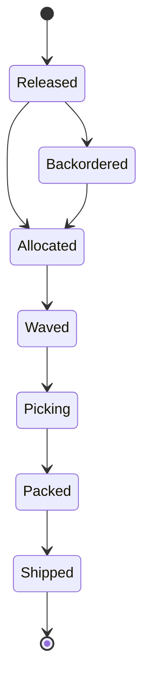
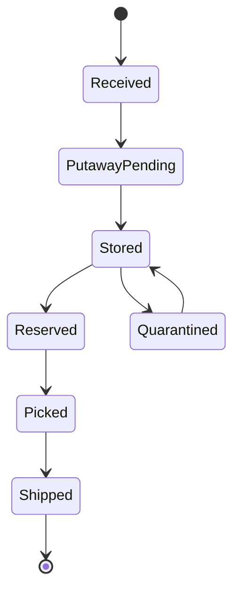
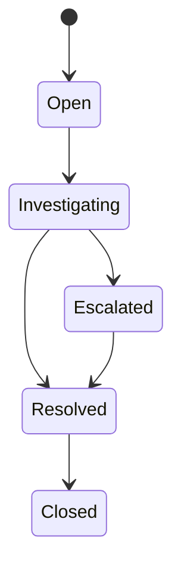

# State Machine Diagrams

## Order Fulfillment Lifecycle

### Transition Guards
- `Released -> Allocated`: all order lines pass allocation policy and ATP check.
- `Picking -> Packed`: every required line is picked or explicitly backordered.
- `Packed -> Shipped`: manifest + label + dock handoff confirmation are complete.

## Inventory Unit Lifecycle

### Transition Guards
- `Received -> PutawayPending`: receipt accepted with ASN/PO validation.
- `Stored -> Reserved`: reservation decrements ATP but not on-hand stock.
- `Reserved -> Picked`: scanner confirms exact SKU/bin/lot match.

## Exception Case Lifecycle

### Enforcement Rules
- Invalid transitions return `409 STATE_TRANSITION_FORBIDDEN` (BR-2).
- `Escalated -> Resolved` requires supervisor role and evidence payload (BR-3/BR-4).
- Terminal `Closed` requires linked remediation action id.
