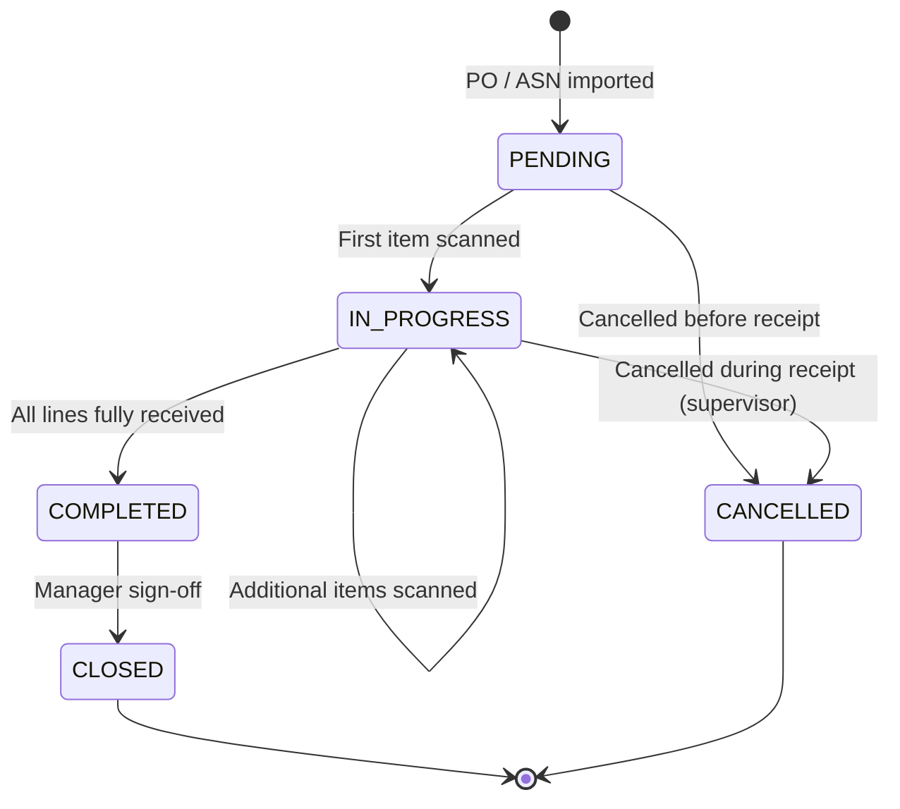
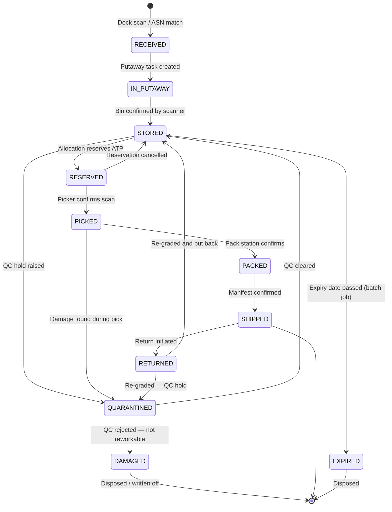
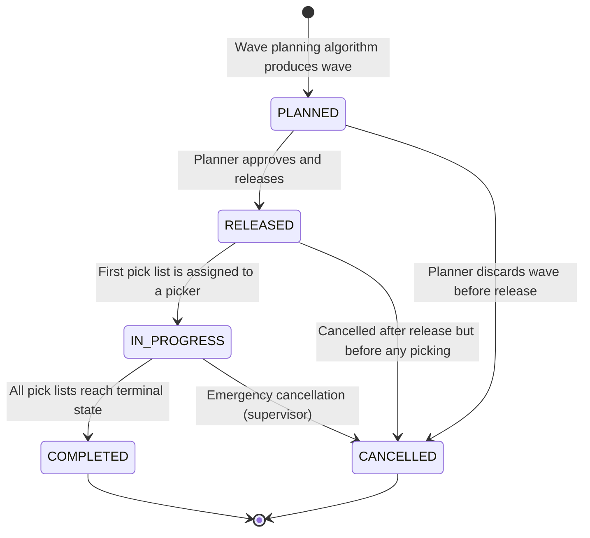
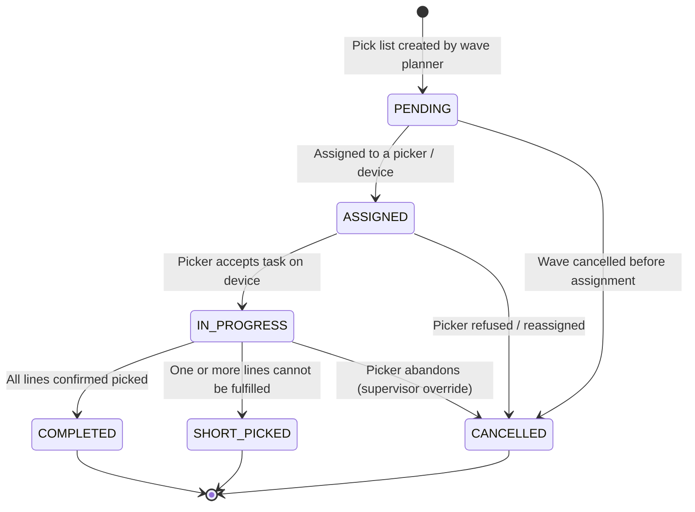
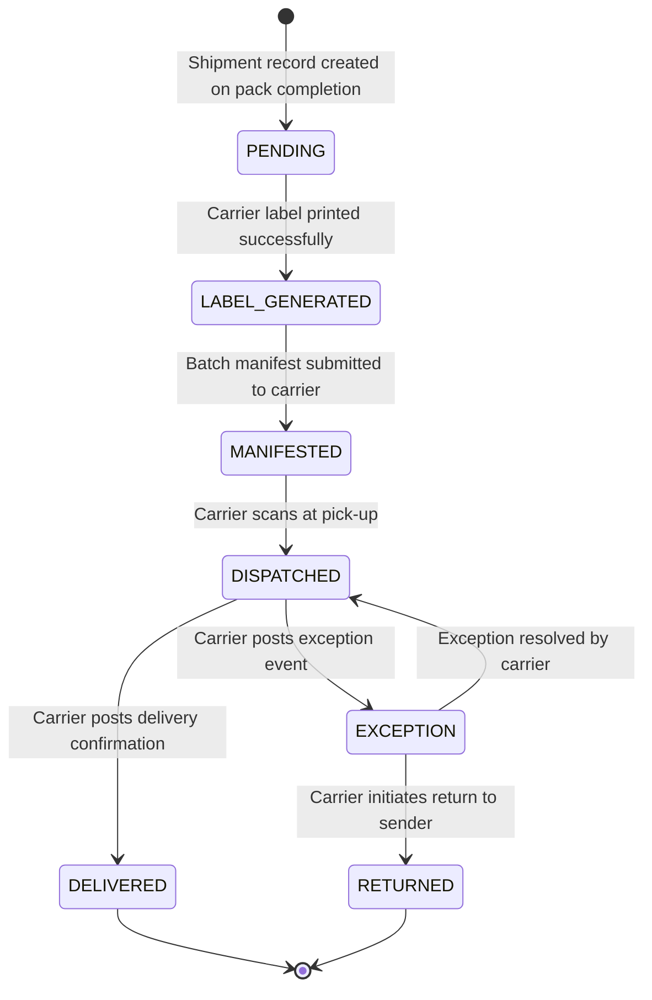

# State Machine Diagrams

## Overview

Every long-lived aggregate in the Warehouse Management System has a finite, well-defined lifecycle. State machines are the primary tool for expressing and enforcing those lifecycles. Each state is stored as a `VARCHAR` enum column on the aggregate table; illegal transitions are blocked at two layers:

1. **Service layer** — a transition guard function evaluates preconditions before calling the repository. If any precondition fails the service throws a domain exception which maps to HTTP `409 CONFLICT` with a structured error body containing an `errorCode` field.
2. **Database layer** — a `CHECK` constraint on the status column enumerates the valid values, and a trigger (or stored procedure) may additionally enforce the allowed `(from_status, to_status)` pairs for critical aggregates.

All state change events are published to the outbox table within the same database transaction, guaranteeing at-least-once delivery to downstream services without distributed coordination.

---

## ReceivingOrder State Machine

A `ReceivingOrder` tracks the physical receipt of goods against a Purchase Order or ASN. It starts as `PENDING` when the PO/ASN is imported, moves to `IN_PROGRESS` once the first item scan is recorded, reaches `COMPLETED` when every expected line is accounted for, transitions to `CLOSED` after the warehouse manager signs off, and can be `CANCELLED` before any physical work begins.



### ReceivingOrder Transition Guard Table

| From State   | To State    | Guard Condition                                                              | Actor            | Error Code                      |
|--------------|-------------|------------------------------------------------------------------------------|------------------|---------------------------------|
| PENDING      | IN_PROGRESS | At least one scan event exists for this order; PO/ASN is not expired        | WMS Scanner / WH Worker | `WMS-RO-001` |
| PENDING      | CANCELLED   | No physical items have been received; requestor has `CANCEL_RECEIVING` role  | WH Manager       | `WMS-RO-002`                    |
| IN_PROGRESS  | COMPLETED   | All expected lines have `received_qty >= expected_qty` or explicit over-receipt approval | WH Worker / System | `WMS-RO-003`         |
| IN_PROGRESS  | CANCELLED   | Supervisor override present; compensation event deallocates any stock already put away | Supervisor  | `WMS-RO-004`                    |
| COMPLETED    | CLOSED      | Quality inspection passed or waived; sign-off user has `CLOSE_RECEIVING` role | WH Manager      | `WMS-RO-005`                    |
| ANY          | ANY (invalid) | Transition not listed above                                                | —                | `WMS-STATE-409`                 |

---

## InventoryUnit State Machine

An `InventoryUnit` represents a single trackable unit of stock — a pallet, case, or each. It starts as `RECEIVED` on dock arrival, moves through putaway, storage, reservation, picking, packing and shipment. It can be diverted to quality holds (`QUARANTINED`, `DAMAGED`) or re-enter the warehouse after a return (`RETURNED`). Units past their best-before date transition to `EXPIRED`.



### InventoryUnit Transition Guard Table

| From State   | To State     | Guard Condition                                                              | Actor            | Error Code        |
|--------------|--------------|------------------------------------------------------------------------------|------------------|-------------------|
| RECEIVED     | IN_PUTAWAY   | Receiving order is IN_PROGRESS or COMPLETED; unit has a valid putaway task   | System           | `WMS-IU-001`      |
| IN_PUTAWAY   | STORED       | Scanner confirms bin barcode matches assigned bin; bin has capacity          | WH Worker        | `WMS-IU-002`      |
| STORED       | RESERVED     | ATP for this SKU/lot/bin is ≥ requested qty; no concurrent conflicting lock  | Allocation Engine| `WMS-IU-003`      |
| STORED       | QUARANTINED  | QC hold reason code provided; user has `RAISE_QC_HOLD` permission            | QC Inspector     | `WMS-IU-004`      |
| STORED       | EXPIRED      | `expiry_date < NOW()`; only the expiry batch job may trigger this            | System (batch)   | `WMS-IU-005`      |
| RESERVED     | PICKED       | Picker scan matches SKU, lot, and bin; wave is IN_PROGRESS                   | WH Picker        | `WMS-IU-006`      |
| RESERVED     | STORED       | Allocation cancelled; reservation record soft-deleted; ATP restored          | Allocation Engine| `WMS-IU-007`      |
| PICKED       | PACKED       | Pack station scan confirms unit; carton weight within tolerance               | Pack Station     | `WMS-IU-008`      |
| PICKED       | QUARANTINED  | Picker reports damage; exception code recorded                               | WH Picker        | `WMS-IU-009`      |
| PACKED       | SHIPPED      | Shipment manifested; carrier label scanned at dock-out                       | Dock Worker      | `WMS-IU-010`      |
| QUARANTINED  | STORED       | QC cleared; disposition = ACCEPT; re-graded lot/bin assigned                 | QC Inspector     | `WMS-IU-011`      |
| QUARANTINED  | DAMAGED      | QC rejected; disposition = REJECT; write-off reference created               | QC Inspector     | `WMS-IU-012`      |
| SHIPPED      | RETURNED     | Return merchandise authorisation (RMA) number provided by CS                 | Customer Service | `WMS-IU-013`      |
| RETURNED     | STORED       | Returned unit inspected; condition grade ≥ SELLABLE; bin assigned            | Returns Worker   | `WMS-IU-014`      |
| RETURNED     | QUARANTINED  | Returned unit failed inspection                                              | Returns Worker   | `WMS-IU-015`      |

---

## WaveJob State Machine

A `WaveJob` orchestrates a batch of pick lists for a scheduling window. It moves from `PLANNED` to `RELEASED` when the planner approves it, to `IN_PROGRESS` as pickers start work, and finally to `COMPLETED` when all constituent pick lists are done.



### WaveJob Transition Guard Table

| From State  | To State    | Guard Condition                                                                  | Actor          | Error Code    |
|-------------|-------------|----------------------------------------------------------------------------------|----------------|---------------|
| PLANNED     | RELEASED    | Wave KPI thresholds met (min lines, max duration); no allocation errors pending  | WH Planner     | `WMS-WJ-001`  |
| PLANNED     | CANCELLED   | No pick lists have been generated or assigned                                    | WH Planner     | `WMS-WJ-002`  |
| RELEASED    | IN_PROGRESS | At least one pick list within the wave transitions to ASSIGNED                   | System         | `WMS-WJ-003`  |
| RELEASED    | CANCELLED   | All pick lists are still PENDING; user has `CANCEL_WAVE` role                    | WH Manager     | `WMS-WJ-004`  |
| IN_PROGRESS | COMPLETED   | All pick lists are COMPLETED, CANCELLED, or SHORT_PICKED                         | System         | `WMS-WJ-005`  |
| IN_PROGRESS | CANCELLED   | Supervisor override; compensation reallocates affected orders                    | Supervisor     | `WMS-WJ-006`  |

---

## PickList State Machine

A `PickList` is a set of pick tasks assigned to one picker for execution within a wave. It can end as `COMPLETED` (all lines fully picked), `SHORT_PICKED` (some lines picked but stock was insufficient), or `CANCELLED`.



### PickList Transition Guard Table

| From State  | To State     | Guard Condition                                                                      | Actor       | Error Code    |
|-------------|--------------|--------------------------------------------------------------------------------------|-------------|---------------|
| PENDING     | ASSIGNED     | Wave is RELEASED or IN_PROGRESS; picker has `PICK` role; device is active            | System      | `WMS-PL-001`  |
| PENDING     | CANCELLED    | Parent WaveJob is CANCELLED; no items have been touched                              | System      | `WMS-PL-002`  |
| ASSIGNED    | IN_PROGRESS  | Picker scans first location barcode confirming start                                 | WH Picker   | `WMS-PL-003`  |
| ASSIGNED    | CANCELLED    | Picker reassigned; all task line reservations are restored                           | WH Manager  | `WMS-PL-004`  |
| IN_PROGRESS | COMPLETED    | Every task line has `picked_qty == requested_qty`                                    | WH Picker   | `WMS-PL-005`  |
| IN_PROGRESS | SHORT_PICKED | At least one line has `picked_qty < requested_qty` and location exhausted            | WH Picker   | `WMS-PL-006`  |
| IN_PROGRESS | CANCELLED    | Supervisor override; all picked units must be returned to bins or re-reserved        | Supervisor  | `WMS-PL-007`  |

---

## ShipmentOrder State Machine

A `ShipmentOrder` represents a customer-facing fulfilment order and orchestrates the end-to-end outbound flow from receipt of the order through to final shipment.

```mermaid
stateDiagram-v2
    [*] --> PENDING : Order imported from OMS
    PENDING --> ALLOCATED : Stock allocated successfully
    PENDING --> BACKORDERED : Insufficient ATP at allocation time
    BACKORDERED --> ALLOCATED : Stock replenished; re-allocation succeeds
    ALLOCATED --> WAVED : Included in released WaveJob
    ALLOCATED --> CANCELLED : Cancellation before wave
    WAVED --> PICKING : Picker begins first pick task
    PICKING --> PACKING : All pick tasks completed
    PICKING --> BACKORDERED : Short pick with no alternate stock
    PACKING --> READY : Pack station confirms carton seal
    READY --> SHIPPED : Carrier scan at dock-out
    READY --> CANCELLED : Order cancelled post-pack (unusual)
    SHIPPED --> [*]
    CANCELLED --> [*]
    BACKORDERED --> CANCELLED : Customer cancels backorder
```

### ShipmentOrder Transition Guard Table

| From State  | To State    | Guard Condition                                                                         | Actor            | Error Code    |
|-------------|-------------|-----------------------------------------------------------------------------------------|------------------|---------------|
| PENDING     | ALLOCATED   | All order lines have sufficient ATP; allocation records committed atomically            | Allocation Engine| `WMS-SO-001`  |
| PENDING     | BACKORDERED | At least one line has zero ATP and backorder policy is ALLOW                            | Allocation Engine| `WMS-SO-002`  |
| BACKORDERED | ALLOCATED   | Replenishment completed; re-allocation succeeds for all previously short lines          | Allocation Engine| `WMS-SO-003`  |
| ALLOCATED   | WAVED       | WaveJob that includes this order transitions to RELEASED                                | Wave Planner     | `WMS-SO-004`  |
| ALLOCATED   | CANCELLED   | Order cancellation request received; reservations released                              | OMS / CS Agent   | `WMS-SO-005`  |
| WAVED       | PICKING     | First pick list for this order moves to IN_PROGRESS                                     | System           | `WMS-SO-006`  |
| PICKING     | PACKING     | All pick lists for this order are COMPLETED or SHORT_PICKED with partial fill approved  | System           | `WMS-SO-007`  |
| PICKING     | BACKORDERED | Short pick detected; no alternate stock; partial hold approved                          | System           | `WMS-SO-008`  |
| PACKING     | READY       | Pack station confirms all cartons sealed; weights recorded                              | Pack Station     | `WMS-SO-009`  |
| READY       | SHIPPED     | Carrier scan at dock-out; tracking number recorded on shipment                          | Dock Worker      | `WMS-SO-010`  |

---

## Shipment State Machine

A `Shipment` represents a physical parcel or freight consignment handed to a carrier. It tracks the carrier lifecycle from label generation through delivery or exception resolution.



### Shipment Transition Guard Table

| From State       | To State         | Guard Condition                                                                 | Actor            | Error Code    |
|------------------|------------------|---------------------------------------------------------------------------------|------------------|---------------|
| PENDING          | LABEL_GENERATED  | Carrier API returns valid label; tracking number saved                          | Carrier API      | `WMS-SH-001`  |
| LABEL_GENERATED  | MANIFESTED       | End-of-day manifest submitted and accepted by carrier                           | System (EOD job) | `WMS-SH-002`  |
| MANIFESTED       | DISPATCHED       | Carrier webhook / polling confirms first scan                                   | Carrier Webhook  | `WMS-SH-003`  |
| DISPATCHED       | DELIVERED        | Carrier posts `DELIVERED` event with POD signature or photo                     | Carrier Webhook  | `WMS-SH-004`  |
| DISPATCHED       | EXCEPTION        | Carrier posts non-delivery exception (lost, damaged, refused)                   | Carrier Webhook  | `WMS-SH-005`  |
| EXCEPTION        | DISPATCHED       | Carrier resolves exception and resumes transit                                  | Carrier Webhook  | `WMS-SH-006`  |
| EXCEPTION        | RETURNED         | Carrier initiates return; RTS tracking number provided                          | Carrier Webhook  | `WMS-SH-007`  |

---

## CycleCount State Machine

A `CycleCount` is a scheduled physical inventory audit of a bin or zone. It progresses from scheduling through active counting, discrepancy review, management approval, and closure.

```mermaid
stateDiagram-v2
    [*] --> SCHEDULED : Count task created by inventory planner
    SCHEDULED --> IN_PROGRESS : Counter begins scanning in assigned location
    SCHEDULED --> CLOSED : Count cancelled before start
    IN_PROGRESS --> UNDER_REVIEW : Counter submits count; system computes variance
    UNDER_REVIEW --> APPROVED : Variance within tolerance; auto-approved or manager approves
    UNDER_REVIEW --> IN_PROGRESS : Recount requested — counter re-scans location
    APPROVED --> CLOSED : Inventory adjustments committed; count closed
    CLOSED --> [*]
```

### CycleCount Transition Guard Table

| From State   | To State     | Guard Condition                                                                  | Actor             | Error Code    |
|--------------|--------------|----------------------------------------------------------------------------------|-------------------|---------------|
| SCHEDULED    | IN_PROGRESS  | Counter has `CYCLE_COUNT` role; bin is not locked by an active picking task      | WH Counter        | `WMS-CC-001`  |
| SCHEDULED    | CLOSED       | Manager explicitly cancels count; no work performed                              | WH Manager        | `WMS-CC-002`  |
| IN_PROGRESS  | UNDER_REVIEW | All bins in scope have been scanned; count submitted                             | WH Counter        | `WMS-CC-003`  |
| UNDER_REVIEW | APPROVED     | Variance ≤ configured tolerance threshold OR manager explicitly approves         | System / Manager  | `WMS-CC-004`  |
| UNDER_REVIEW | IN_PROGRESS  | Manager requests recount; previous count data archived                           | WH Manager        | `WMS-CC-005`  |
| APPROVED     | CLOSED       | Inventory adjustment journal entries committed; audit trail written              | System            | `WMS-CC-006`  |

---

## ReplenishmentTask State Machine

A `ReplenishmentTask` moves stock from reserve/bulk storage to an active pick face when that face falls below a minimum quantity threshold.

```mermaid
stateDiagram-v2
    [*] --> PENDING : Replenishment trigger fires (min-qty breach)
    PENDING --> ASSIGNED : Task assigned to a warehouse worker
    PENDING --> CANCELLED : Superseded by a higher-priority task or stock error
    ASSIGNED --> IN_PROGRESS : Worker scans source bin to begin move
    ASSIGNED --> CANCELLED : Worker cannot fulfil; reassigned or cancelled
    IN_PROGRESS --> COMPLETED : Worker scans destination bin; qty confirmed
    IN_PROGRESS --> CANCELLED : Supervisor cancels mid-task
    COMPLETED --> [*]
    CANCELLED --> [*]
```



### ReplenishmentTask Transition Guard Table

| From State  | To State    | Guard Condition                                                                     | Actor          | Error Code    |
|-------------|-------------|--------------------------------------------------------------------------------------|----------------|---------------|
| PENDING     | ASSIGNED    | Source bin has sufficient on-hand qty; destination bin has capacity; worker available | System / WFM   | `WMS-RT-001`  |
| PENDING     | CANCELLED   | Source bin stock already moved by another task; ATP insufficient                     | System         | `WMS-RT-002`  |
| ASSIGNED    | IN_PROGRESS | Worker scans source bin barcode; qty check passes                                    | WH Worker      | `WMS-RT-003`  |
| ASSIGNED    | CANCELLED   | Worker cannot fulfil task (damaged stock, access issue); reason code required        | WH Worker      | `WMS-RT-004`  |
| IN_PROGRESS | COMPLETED   | Worker scans destination bin; system confirms moved qty matches task qty             | WH Worker      | `WMS-RT-005`  |
| IN_PROGRESS | CANCELLED   | Supervisor override; partial move compensation reverts any partial stock moves       | Supervisor     | `WMS-RT-006`  |

---

## Global Rules

The following rules apply uniformly across all state machines in the WMS.

1. **Single source of truth** — the `status` column on the aggregate table is the authoritative state. No out-of-band status inference from related records.
2. **Transition atomicity** — every state transition, its side-effects (e.g., inventory reservation, event publication), and the resulting audit log entry are committed in a single database transaction.
3. **Forbidden transition response** — any attempt to apply an unlisted `(from, to)` transition returns HTTP `409 CONFLICT` with body `{ "errorCode": "WMS-STATE-409", "from": "<state>", "to": "<state>" }`.
4. **Terminal states are immutable** — aggregates in terminal states (`CLOSED`, `CANCELLED`, `SHIPPED`, `DELIVERED`, `EXPIRED`, `DAMAGED`) cannot be modified. Any attempt returns HTTP `422 UNPROCESSABLE_ENTITY` with `errorCode: WMS-STATE-422`.
5. **Idempotent transitions** — if the aggregate is already in the target state, the service returns `200 OK` (not an error), making all state transitions safe to retry.
6. **Audit trail** — every transition writes a row to the `state_transition_log` table recording: `aggregate_type`, `aggregate_id`, `from_state`, `to_state`, `actor_id`, `reason`, `timestamp`.
7. **Compensation on failure** — if a transition side-effect fails after the DB commit (e.g., outbox relay timeout), the outbox guarantees re-delivery. If the side-effect is non-retryable, a compensating transaction is triggered and logged.
8. **Role enforcement** — guard conditions that include a role check are enforced by the service layer using the authenticated principal's permissions; unauthorised attempts return HTTP `403 FORBIDDEN` with `errorCode: WMS-AUTH-403`.
9. **Optimistic concurrency** — all state-changing operations include a `version` check. A stale `version` returns HTTP `409 CONFLICT` with `errorCode: WMS-CONCURRENCY-409`.
10. **Database-level safety net** — a `CHECK` constraint on every `status` column enumerates valid values. A database trigger on critical tables additionally enforces allowed `(old_status, new_status)` pairs as a defence-in-depth measure.
