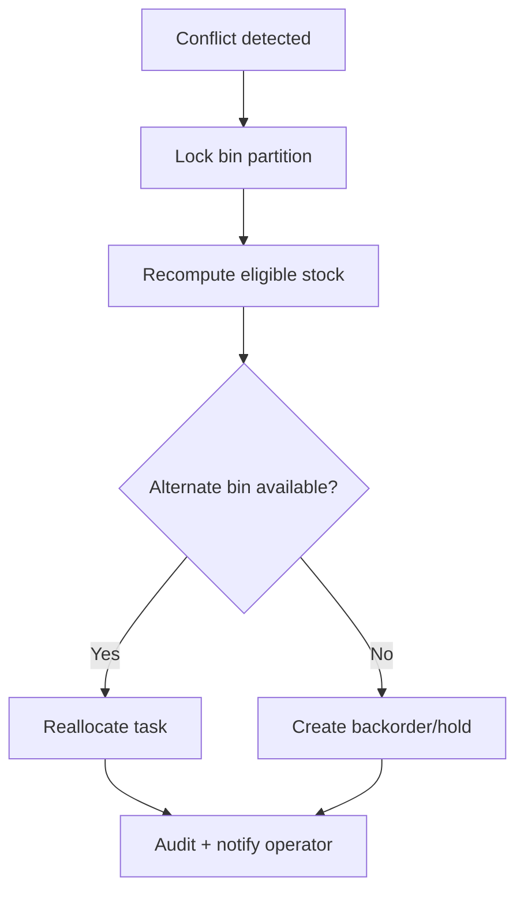

# Bin Conflicts

## Scenario
Concurrent picks/reservations target same bin causing over-commit risk.

## Detection
- Reservation conflict rate per bin exceeds threshold.
- Negative ATP guard attempted (blocked) events increase.

## Resolution Workflow

## Preventive Controls
- Bin-level hot-spot monitoring.
- Dynamic wave throttling for over-subscribed zones.
- Reservation conflict chaos tests in CI.
