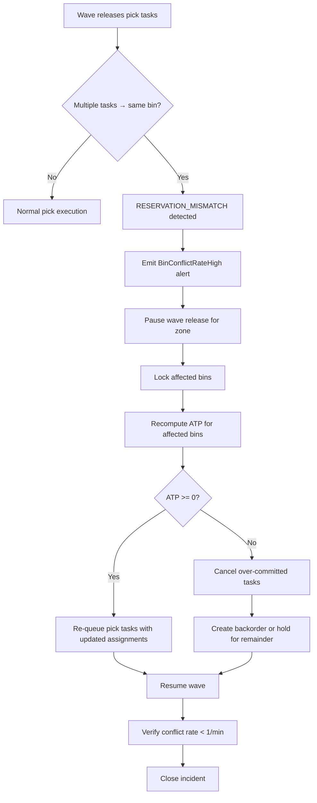

# Bin Conflicts

## Failure Mode

Two or more workers concurrently attempt to pick from — or putaway to — the same bin, causing over-commitment beyond the bin's physical capacity or driving inventory ATP negative. The conflict is triggered during peak wave release when the wave planner emits multiple pick tasks referencing the same bin within the same scheduling tick. It also occurs when a simultaneous putaway and pick race on the same bin, or when the reservation service processes two allocation requests before either has committed to the database.

Trigger conditions:
- Wave planner assigns ≥ 2 pick tasks to the same bin in the same wave batch.
- A putaway confirmation and a pick confirmation arrive within the same DB transaction window.
- A scanner retry (after timeout) re-submits a reservation that has already been partially committed.

---

## Impact

- **ATP goes negative**: blocked by BR-11, but the worker receives a `STOCK_UNAVAILABLE` error mid-pick, disrupting flow.
- **Worker confusion**: the picker reaches the bin and finds zero or insufficient stock.
- **Wave replan required**: the affected wave lines must be re-queued, reducing throughput.
- **Order SLA breach**: if the wave is on the critical path for a same-day or next-day shipment.
- **Duplicate picks**: if idempotency is not enforced, two workers may each believe they completed the pick.
- **Inventory accuracy degradation**: conflicting ledger entries may leave the bin balance inconsistent.

---

## Detection

- **Metric**: `reservation_conflict_rate` per bin > 5/min → alert `BinConflictRateHigh` (Sev-2).
- **Event**: `ATP_NEGATIVE_ATTEMPT` emitted by inventory service when guard blocks a reservation.
- **Log pattern**: `RESERVATION_MISMATCH` errors in pick-handler service logs.
- **Metric**: `pick_task.status = FAILED` spike > 3× baseline over a 5-minute window.
- **Dashboard**: hot-bin heatmap showing bins with > 10 concurrent reservation attempts per wave.

---

## Mitigation

1. **Zone Supervisor**: pause new wave task release for the affected zone via `POST /waves/{waveId}/pause`.
2. **On-call Engineer**: freeze bin assignments for flagged bins: `PATCH /bins/{binId}/lock { "reason": "conflict_resolution" }`.
3. **On-call Engineer**: pull all `FAILED` pick tasks for the wave from the task queue and mark them `HELD`.
4. **Inventory Manager**: run the ATP invariant check query (see below) to identify all bins with negative or zero ATP under active reservations.
5. **Zone Supervisor**: notify affected pickers via the WMS handheld UI to stand by; do not attempt alternate picks independently.
6. **On-call Engineer**: open a Sev-2 incident ticket with bin IDs, wave ID, and conflict count.

---

## Recovery

1. Run the SQL invariant check (see below) to enumerate all affected bins and their current ATP.
2. For each affected bin, cancel conflicting pick tasks: `POST /tasks/bulk-cancel { "bin_ids": [...], "reason": "bin_conflict" }`.
3. Recompute ATP for each affected bin using the ledger recompute job: `POST /inventory/recompute-atp { "bin_ids": [...] }`.
4. **Checkpoint**: verify no bin in the affected set has ATP < 0 before proceeding.
5. Re-queue cancelled tasks against the wave planner with updated bin assignments.
6. Resume the wave: `POST /waves/{waveId}/resume`.
7. **Checkpoint**: confirm `reservation_conflict_rate` returns to < 1/min within 5 minutes of resume.
8. Close the incident ticket with root-cause note (wave planner deduplication gap or lock contention).

---

## Prevention

- **Optimistic locking**: add a `version` column to `inventory_balance`; reject updates with stale version.
- **Bin-level partitioned locks**: acquire a distributed lock keyed on `bin_id` before writing any reservation; use TTL of 500 ms.
- **Wave-level bin deduplication**: wave planner must deduplicate bin assignments within a single wave batch before task emission.
- **Hot-bin detection**: identify bins with > 5 reservations/min during wave planning and spread picks across alternative bins or split the wave.
- **Chaos regression test**: include a concurrent-reservation test in CI that races 10 goroutines/threads against the same bin and asserts no negative ATP.

---

## Resolution Workflow



---

## SQL Invariant Check

```sql
-- Find all bins where current ATP is negative or active reservations exceed available stock
SELECT
    b.bin_id,
    b.sku_id,
    b.on_hand_qty,
    COALESCE(SUM(r.reserved_qty), 0)         AS total_reserved,
    b.on_hand_qty - COALESCE(SUM(r.reserved_qty), 0) AS atp
FROM inventory_balance b
LEFT JOIN reservations r
    ON r.bin_id = b.bin_id AND r.status IN ('ACTIVE', 'IN_PROGRESS')
GROUP BY b.bin_id, b.sku_id, b.on_hand_qty
HAVING (b.on_hand_qty - COALESCE(SUM(r.reserved_qty), 0)) < 0;
```

---

## Related Edge Cases

- **Partial Picks / Backorders** (`partial-picks-backorders.md`): a bin conflict that is not detected until the picker physically arrives manifests as a short-pick.
- **Offline Scanner Sync** (`offline-scanner-sync.md`): buffered offline events replaying on reconnection can create artificial bin conflicts if the state diverged during the offline window.

---

## Test Scenarios to Add

| # | Scenario | Expected Outcome |
|---|---|---|
| T-BC-01 | Two concurrent reservation requests for the last unit in a bin | Exactly one succeeds; the other returns `409 RESERVATION_CONFLICT` |
| T-BC-02 | Wave planner emits 5 tasks to the same bin in one batch | Planner deduplicates to 1 task; remaining 4 re-assigned to alternate bins |
| T-BC-03 | Putaway and pick race on the same bin simultaneously | Optimistic lock prevents double-commit; one operation retries |
| T-BC-04 | Scanner retry re-submits a reservation already committed | Idempotency key returns prior successful response; no duplicate ledger row |
| T-BC-05 | ATP invariant check after forced conflict injection | Zero bins with negative ATP after recovery procedure |
