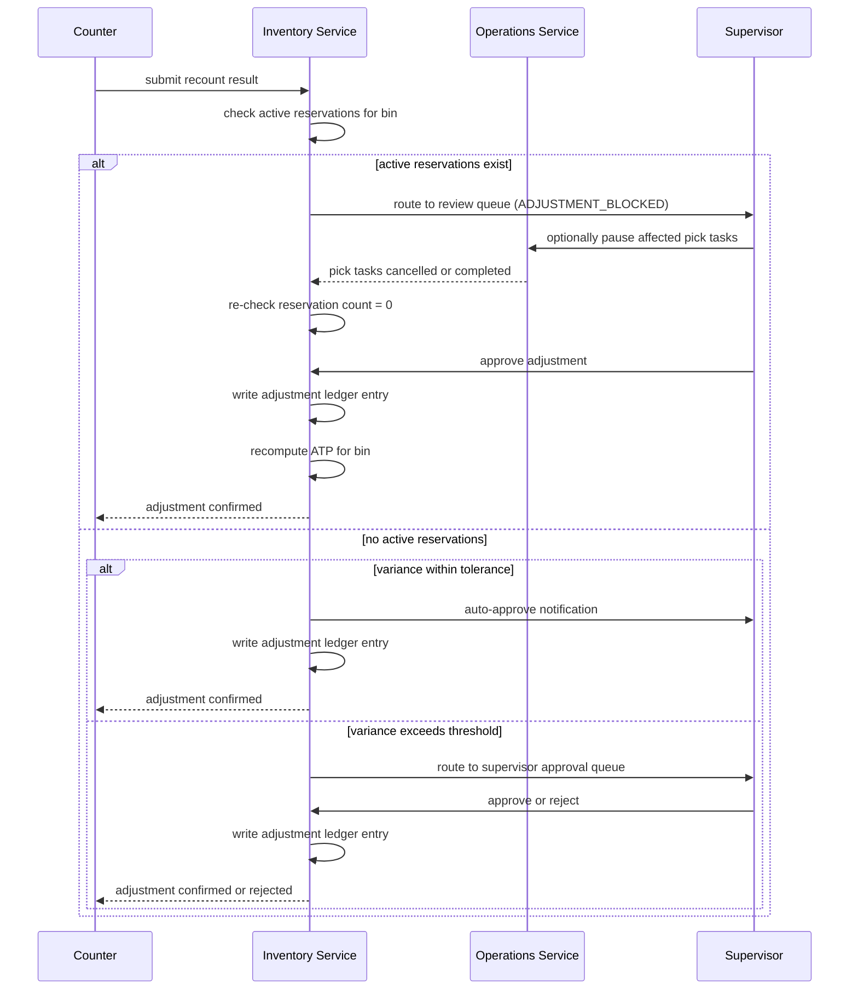

# Cycle Count Adjustments

## Failure Mode

A cycle count is submitted for a bin or SKU while active pick tasks, putaway tasks, or reservations are still in flight for that exact bin/SKU combination. Applying the count result immediately would either:
- Invalidate an in-progress reservation (the picker believes stock exists, but the adjustment removes it).
- Create negative ATP if the count result is lower than the currently reserved quantity.
- Generate a false positive variance if a pick that is mid-flight has not yet been confirmed to the ledger.

Trigger conditions:
- Counter submits a recount result via the mobile app while `reservations.status = IN_PROGRESS` for the same bin.
- A supervisor approves a large-variance adjustment without checking the active-reservation count.
- Automated cycle count job runs during a busy wave period without bin pre-freeze.

---

## Impact

- **Ongoing picks may be based on incorrect quantities**: if the count reveals less stock, an in-flight pick will fail mid-task.
- **Over-shipment risk**: if the adjustment increases stock that was already allocated, duplicate allocations may occur.
- **Inventory accuracy KPI degraded**: premature or incorrect adjustments skew the accuracy percentage metric.
- **Financial impact**: high-value items (e.g., pharmaceuticals, electronics) with large variances represent direct P&L exposure.
- **Audit risk**: adjustments applied without proper sequencing may not satisfy SOX or FDA documentation requirements.
- **Wave disruption**: if a large bin's count freezes it mid-wave, the wave throughput drops significantly.

---

## Detection

- **Metric**: `|variance_pct|` per bin > 2% → alert `CycleCountVarianceAlert` (Sev-3, escalates to Sev-2 if > 10%).
- **Condition**: active reservation count > 0 for the affected bin at time of count submission → system blocks approval and routes to supervisor review queue.
- **Metric**: supervisor review queue depth > 10 items for > 15 minutes → alert `CycleCountReviewQueueHigh`.
- **Log pattern**: `ADJUSTMENT_BLOCKED_ACTIVE_RESERVATIONS` in the inventory adjustment service.
- **Financial alert**: variance value (units × unit_cost) > $500 → notify Inventory Manager directly.

---

## Mitigation

**Counter role:**
1. Submit count result via mobile app; system will flag if active reservations exist for the bin.
2. Do not attempt to override the block — mark the bin for re-count after tasks complete.
3. Document any visible discrepancies (damage, misplaced stock) in the count notes field.

**Supervisor role:**
4. Review flagged count in the supervisor queue; confirm active task count for the bin.
5. Decide: (a) wait for in-flight tasks to complete before approving adjustment, or (b) pause the pick tasks for the bin and approve immediately if urgency requires.
6. For variances > 5%, escalate to Inventory Manager before approving.

**Inventory Manager role:**
7. For large variances, open an investigation case (`POST /investigations { "bin_id": ..., "variance_pct": ... }`).
8. Notify Finance if variance value > $500 for cost accrual assessment.

---

## Recovery

1. Wait for all active reservations and pick tasks for the affected bin to reach terminal state (COMPLETED or CANCELLED).
2. **Checkpoint**: query `SELECT COUNT(*) FROM reservations WHERE bin_id = ? AND status IN ('ACTIVE','IN_PROGRESS')` → must return 0.
3. Apply the adjustment ledger entry: `POST /inventory/adjustments { "bin_id": ..., "delta_qty": ..., "reason": "cycle_count", "approved_by": ... }`.
4. **Checkpoint**: run ATP invariant query to confirm no negative ATP after adjustment.
5. Update the cycle count record status to `APPLIED`; record the adjustment ledger ID for audit linkage.
6. Recalculate `inventory_accuracy_pct` for the affected location and update the KPI dashboard.
7. If an investigation case was opened, link the adjustment to the case and update its status to `RESOLVED`.

---

## Safe Adjustment Sequence

---

## Variance Approval Thresholds

| Variance % | Variance Value | Action Required | Approver Level |
|---|---|---|---|
| 0 – 1% | Any | Auto-approve; audit log entry | System (automatic) |
| 1 – 2% | < $100 | Auto-approve with supervisor notification | System + Supervisor notified |
| 1 – 2% | ≥ $100 | Supervisor queue approval required | Supervisor |
| 2 – 5% | Any | Supervisor approval; investigation case opened | Supervisor |
| > 5% | Any | Inventory Manager approval; finance notification | Inventory Manager |
| > 10% | Any | Dual-approval (Inventory Manager + Finance); possible security review | Inventory Manager + Finance |

---

## Investigation Protocol for Large Variances

1. Open investigation case with bin ID, SKU, count date, expected qty, actual qty, and variance %.
2. Pull the last 30 days of ledger transactions for the bin/SKU to identify the divergence point.
3. Review CCTV footage for the bin location if available (security team co-ordination).
4. Interview workers who last performed picks or putaways in the affected bin.
5. Physical re-count with a second counter (dual-witness count) to confirm the result.
6. Determine root cause: damage, theft, misplacement, system error, or counting error.
7. Close investigation case with root cause, corrective action, and financial write-off amount if applicable.

---

## Financial Impact Assessment

1. Calculate variance value: `|delta_qty| × unit_cost`.
2. If variance value > $500: notify Finance within 1 business hour for cost accrual.
3. If variance value > $5,000: flag for Shrinkage Report; escalate to Operations Director.
4. Determine insurance or write-off treatment based on root cause (damage vs. theft vs. system error).
5. Record financial impact in the investigation case for monthly shrinkage reporting.

---

## Related Business Rules

- **BR-08 (Adjustment Approval)**: no inventory adjustment may be applied without approval at the appropriate level.
- **BR-11 (ATP Guard)**: adjustments that would result in negative ATP are blocked until reservations are cleared.

---

## Test Scenarios to Add

| # | Scenario | Expected Outcome |
|---|---|---|
| T-CC-01 | Count submitted while 3 active reservations exist on the bin | System blocks adjustment; routes to supervisor queue |
| T-CC-02 | Variance = 0.5%, no active reservations | Auto-approved; ledger entry written |
| T-CC-03 | Variance = 8%, value = $1,200 | Inventory Manager approval required; Finance notified |
| T-CC-04 | Adjustment applied; resulting ATP would be negative | System rejects; error `ADJUSTMENT_WOULD_NEGATIVE_ATP` |
| T-CC-05 | Investigation case opened for large variance | Case linked to adjustment ledger entry on approval |
