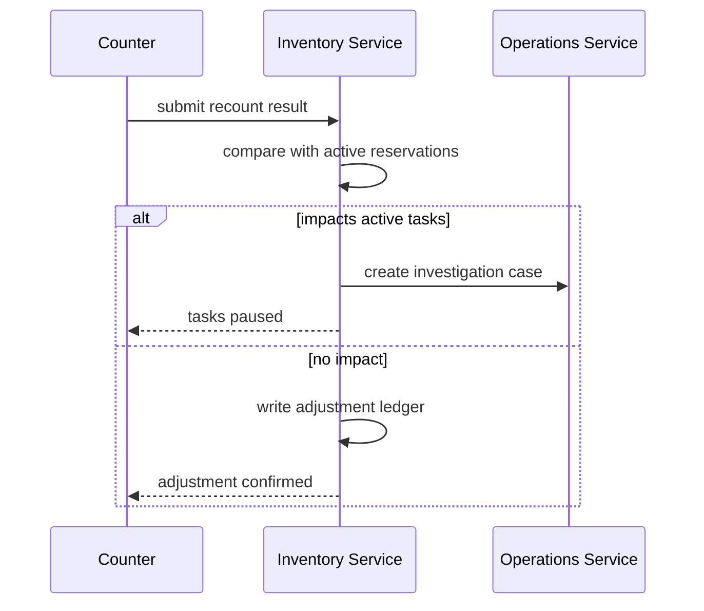

# Cycle Count Adjustments

## Scenario
Count variance occurs while active picks are in progress.

## Decision Matrix

| Condition | Action |
|---|---|
| Small variance within tolerance | supervisor approval + adjustment ledger |
| Large variance / suspected loss | quarantine bin + investigation case |
| Open pick tasks affected | pause impacted tasks + replan |

## Safe Adjustment Sequence

