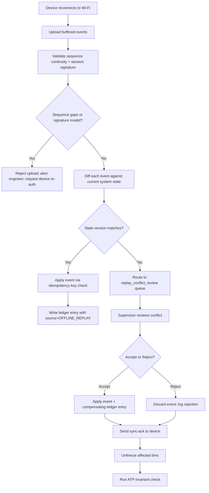

# Offline Scanner Sync

## Failure Mode

An RF scanner loses Wi-Fi connectivity in a warehouse dead zone — commonly cold-storage areas, thick metal racking aisles, or loading dock recesses — and continues recording picks and putaways locally in its offline buffer. Upon reconnection, the buffered events are uploaded in bulk. During the offline window, other workers or automated system processes may have changed the state of the same bins or SKUs, creating conflicts between the buffered events and the current system state.

Trigger conditions:
- Scanner offline for > 60 seconds (dead zone or AP failure).
- Scanner returns to coverage and uploads > 1 buffered event.
- At least one buffered event references a bin whose inventory state changed during the offline window.

---

## Impact

- **Duplicate pick confirmations**: a buffered pick confirmation replays after another worker already picked the same stock.
- **Ghost inventory movements**: a buffered putaway creates a stock record for units that were physically moved elsewhere.
- **ATP calculation errors**: the replayed events produce incorrect on-hand quantities.
- **Double-shipment risk**: for serialised items, a duplicate pick confirmation could trigger two shipment labels for the same unit.
- **Compliance audit gap**: if events cannot be reconciled, the audit trail has an unresolved conflict marker.
- **Worker productivity loss**: supervisor must manually resolve each conflict case, taking 5–15 minutes per conflict.

---

## Detection

- **Alert**: device offline duration > 60 s → alert `ScannerOfflineTooLong` (Sev-3).
- **Event spike**: bulk upload event count > 5 from a single device within 30 s → alert `BulkReplayEventSpike`.
- **Metric**: `replay_conflict_case` creation rate > 2/min → alert `ReplayConflictRateHigh` (Sev-2).
- **Sequence gap**: device sequence numbers contain a gap (e.g., seq 45 → 67) indicating missed events or reorder → alert `DeviceSequenceGap`.
- **Log pattern**: `REPLAY_CONFLICT` in the event-ingestion service logs.

---

## Mitigation

1. **System (automated)**: on device reconnection, validate the upload package — check device ID, session token, and sequence number continuity.
2. **System (automated)**: compute expected sequence range from last acknowledged event; flag any gaps or out-of-order sequences.
3. **On-call Engineer**: freeze all bins referenced in the buffered event batch: `POST /bins/bulk-lock { "bin_ids": [...], "reason": "offline_replay_pending" }`.
4. **On-call Engineer**: route all conflicting events to the `replay_conflict_review` queue; do not apply them automatically.
5. **Warehouse Supervisor**: notified via alert with the count of conflicting events and affected bin list.
6. **System (automated)**: apply all non-conflicting events immediately using deterministic idempotency key check.

---

## Recovery

1. For each event in the `replay_conflict_review` queue, supervisor reviews the conflict details (expected state vs. actual state at replay time).
2. Supervisor selects resolution action per conflict:
   - **Accept replay**: apply the buffered event; create compensating ledger entry for the state delta.
   - **Reject replay**: discard the buffered event; log rejection reason; no inventory change.
3. **Checkpoint**: after all conflicts resolved, run ATP invariant query — zero bins with negative ATP.
4. Write compensating ledger entries for all accepted resolutions with `source = OFFLINE_REPLAY_RESOLUTION`.
5. Send device sync acknowledgment to the scanner: `POST /devices/{deviceId}/sync-ack { "last_accepted_seq": N }`.
6. **Checkpoint**: confirm device sequence is in sync (next event from device uses seq N+1).
7. Unfreeze all bins that were locked for replay: `POST /bins/bulk-unlock { "bin_ids": [...] }`.
8. Update the audit log with a reconciliation summary: events received, applied, rejected, and compensating entries written.

---

## Conflict Resolution Flow



---

## Device Reconnection Protocol

1. Device sends `POST /devices/{deviceId}/reconnect` with the buffered event package and last acknowledged sequence number.
2. Server validates the HMAC signature on the package (signed with the device session key).
3. Server checks for sequence continuity; if gap detected, requests full re-sync from the last acknowledged event.
4. Server processes events in strict sequence order; any event with a duplicate idempotency key is silently acknowledged (already applied).
5. Server sends `sync-ack` containing the range of accepted events and the list of conflict case IDs for supervisor review.
6. Device displays reconciliation summary to the operator: "X events applied, Y conflicts pending supervisor review."

---

## Idempotency Key Design for Scanner Events

Each scanner event must include a deterministic idempotency key constructed as:

```
idempotency_key = SHA256( device_id + ":" + session_id + ":" + sequence_no )
```

- **`device_id`**: permanent device identifier (hardware serial).
- **`session_id`**: rotated each shift login; prevents cross-session replays.
- **`sequence_no`**: monotonically increasing per device per session; never reset mid-session.

The server stores all processed idempotency keys for 72 hours. Any event with a key already present returns the original response without re-processing.

---

## Maximum Offline Duration Policy

| Scenario | Max Offline Buffer Time | Action on Breach |
|---|---|---|
| Standard pick/putaway operations | 30 minutes | Device auto-locks; operator must re-authenticate on reconnection |
| Cold storage zone (known dead zone) | 30 minutes | Same; AP extension kit required if > 30 min operations expected |
| Maintenance/firmware update | N/A (no events buffered) | N/A |
| Battery-swap (planned offline) | 5 minutes | Short grace window; events re-queued on session resume |

If a device exceeds the maximum offline duration, its buffered events are quarantined for mandatory supervisor review before any are applied, regardless of conflict status.

---

## Related Business Rules

- **BR-05 (Idempotency)**: every scanner event must carry a deterministic idempotency key; duplicate submissions must be safe to retry.
- **BR-10 (Deterministic Exception Handling)**: conflicts must never be silently discarded; every conflict must produce a reviewable case.

---

## Test Scenarios to Add

| # | Scenario | Expected Outcome |
|---|---|---|
| T-OS-01 | Scanner offline 10 min; 8 buffered events, no conflicts | All 8 applied on reconnect; sync-ack sent |
| T-OS-02 | Scanner offline 10 min; 3 of 8 events conflict with state changes | 5 applied; 3 routed to conflict queue; bins frozen |
| T-OS-03 | Same event uploaded twice (idempotency key duplicate) | Second upload silently acknowledged; no duplicate ledger row |
| T-OS-04 | Sequence gap detected in uploaded batch | Batch rejected; `DeviceSequenceGap` alert fires |
| T-OS-05 | Device offline > 30 min; events uploaded on reconnect | Events quarantined; mandatory supervisor review; device re-auth required |
| T-OS-06 | Serialised item picked offline; same serial picked by another worker online | Conflict detected; duplicate pick case created; double-shipment prevented |
