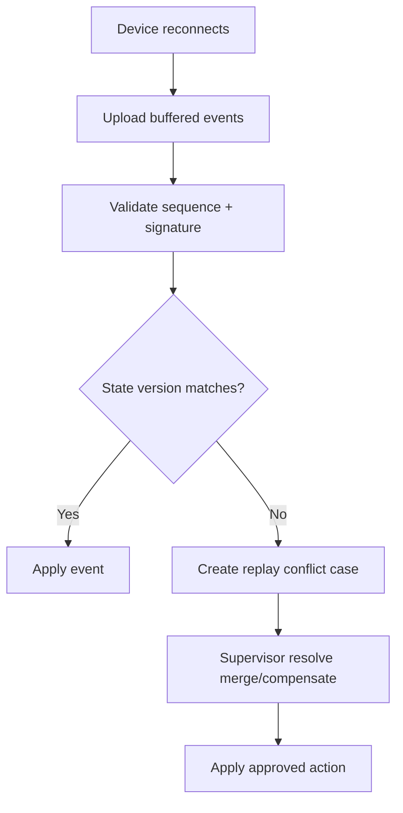

# Offline Scanner Sync

## Scenario
Scanner reconnects and uploads buffered events that may conflict with current state.

## Replay Rules
- Events must be ordered by device sequence number.
- Each event uses deterministic idempotency key (`device_id + sequence_no`).
- Version conflicts generate review tasks, never silent overwrite.

## Conflict Resolution Flow

## Verification
- Post-sync invariant check: no negative ATP, no duplicate ledger rows.
- Device receives reconciliation summary for operator confirmation.
