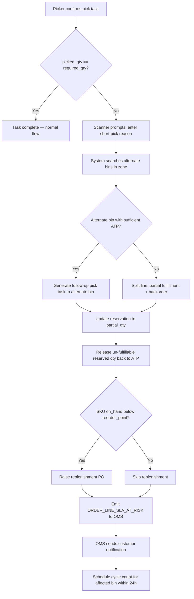

# Partial Picks and Backorders

## Failure Mode

A picker arrives at the assigned bin and finds fewer units than the pick task requires. Root causes include:
- **Unrecorded damage**: a prior handler damaged and discarded units without logging a loss.
- **Miscounted stock**: a previous cycle count or receiving event recorded an incorrect quantity.
- **Wave collision**: a concurrent pick task (bin-conflict scenario) consumed units before this worker arrived.
- **Discovered expiry or quarantine**: the picker notices expired date codes or damaged packaging and correctly refuses to pick those units.
- **Putaway shortfall**: the original received ASN quantity was short and the discrepancy was not caught at inbound.

Trigger: `pick_task.picked_qty < pick_task.required_qty` at task completion event.

---

## Impact

- **Order line cannot be fully fulfilled**: the customer's committed quantity is at risk.
- **Customer SLA breach**: same-day or next-day orders may miss the carrier cut-off.
- **Wave throughput reduction**: the task must be re-routed or a backorder created, adding latency to the wave.
- **Inventory accuracy discrepancy revealed**: the short-pick surface a variance that must be investigated.
- **Replenishment trigger**: if stock falls below reorder point, a replenishment order must be raised.
- **Financial impact**: if a high-value item, the shortfall may represent significant unmet revenue for the order cycle.

---

## Detection

- **Event**: `PICK_SHORT` emitted when `picked_qty < required_qty`.
- **Metric**: short-pick rate > 2% of picks/hour → alert `ShortPickRateHigh` (Sev-2).
- **Dashboard**: order SLA-at-risk flag when a short-pick affects an order within 2 hours of carrier cut-off.
- **Log pattern**: `SHORT_PICK_REASON=[DAMAGE|EXPIRED|NOT_FOUND|QTY_MISMATCH]` in pick-handler logs.
- **Replenishment alert**: `on_hand_qty` < `reorder_point` for affected SKU after short-pick adjustment.

---

## Mitigation

1. **Scanner / WMS UI**: prompts picker to enter short-pick reason code (DAMAGE / EXPIRED / NOT_FOUND / QTY_MISMATCH).
2. **System (automated)**: checks alternate bins in the same zone for the same SKU with sufficient ATP.
3. **If alternate bin found**: system automatically generates a follow-up pick task routed to the alternate bin; picker is directed there immediately.
4. **If no alternate bin**: system splits the order line — creates a partial fulfillment for `picked_qty` and a backorder line for `required_qty - picked_qty`.
5. **Warehouse Supervisor**: notified via alert if the short-pick affects an SLA-critical order; supervisor may authorise substitute SKU or expedite replenishment.
6. **Inventory Manager**: short-pick reason code triggers an investigation task for the affected bin; a cycle count is scheduled within 24 hours.
7. **OMS Integration**: system emits `ORDER_LINE_SLA_AT_RISK` event to OMS within 60 seconds of the short-pick confirmation.

---

## Recovery

1. Update the reservation record to `partial_qty = picked_qty`; release the un-fulfillable reserved quantity back to ATP.
2. Generate a backorder record with:
   - `backorder_reason` = short-pick reason code
   - `expected_fulfillment_date` = earliest replenishment ETA + processing lead time
3. If `on_hand_qty` for the SKU falls below `reorder_point`, automatically raise a replenishment purchase order via the procurement integration.
4. **Checkpoint**: confirm the backorder record exists and the released ATP is reflected in the `inventory_balance` table.
5. Emit `CUSTOMER_BACKORDER_NOTIFICATION` event to OMS; OMS sends customer-facing communication per the channel preference.
6. Update wave KPI dashboards: increment `short_pick_count`, `backorder_lines_created`, and `sla_at_risk_orders` counters.
7. **Checkpoint**: confirm short-pick rate alert clears within 15 minutes (i.e., this is not a systemic wave issue).
8. Schedule a cycle count for all bins of the affected SKU within 24 hours to identify root cause.

---

## Handling Flow

---

## Backorder Policy Rules

| Condition | Action |
|---|---|
| Alternate bin found in same zone | Generate follow-up pick; no backorder created |
| Alternate bin found in different zone | Generate follow-up pick; SLA impact assessed |
| No alternate; order SLA > 48 h away | Create backorder; replenishment ordered |
| No alternate; order SLA ≤ 48 h | Backorder + escalate to supervisor for substitute approval |
| Reason = EXPIRED or DAMAGE | Quarantine units; trigger write-off workflow; create backorder |
| Reason = NOT_FOUND with > 5% variance | Initiate full bin investigation before backorder creation |

---

## Customer Communication Flow

1. OMS receives `CUSTOMER_BACKORDER_NOTIFICATION` event within 60 s of short-pick confirmation.
2. OMS checks customer notification preference (email / SMS / push).
3. Notification includes: order number, affected item, partial fulfillment date, backorder ETA.
4. If customer SLA was guaranteed (e.g., Prime-equivalent), OMS applies compensation voucher automatically.
5. Customer can opt to cancel the backorder line within 24 hours via self-service portal.

---

## Related Business Rules

- **BR-09 (Backorder Policy)**: defines when backorders are permitted vs. when the line must be cancelled or substituted.
- **BR-11 (ATP Guard)**: after releasing partial reserved qty, ATP must be ≥ 0 for all remaining reservations on the bin.

---

## Test Scenarios to Add

| # | Scenario | Expected Outcome |
|---|---|---|
| T-PP-01 | Picker picks 3 of 5 required units; alternate bin has 2 | Follow-up task created; no backorder |
| T-PP-02 | Picker picks 3 of 5 required units; no alternate bin | Backorder line for 2 units; ATP released |
| T-PP-03 | Short-pick reason = EXPIRED; 4 units in bin all expired | All 4 quarantined; full backorder; write-off workflow triggered |
| T-PP-04 | Short-pick pushes SKU below reorder point | Replenishment PO raised automatically |
| T-PP-05 | Short-pick on SLA-critical order within 2 h of carrier cut-off | Supervisor notified immediately; SLA-at-risk flag set |
| T-PP-06 | Short-pick rate exceeds 2% in a 1-hour window | `ShortPickRateHigh` alert fires; wave planner pauses review |
