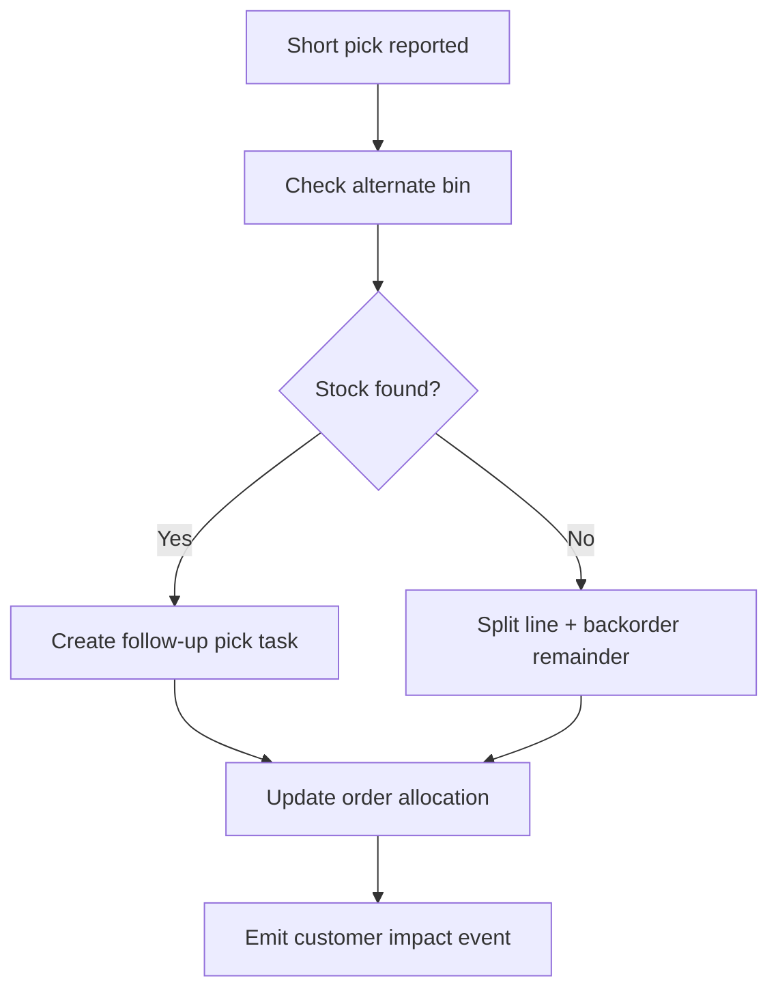

# Partial Picks and Backorders

## Scenario
Picker cannot fulfill full reserved quantity due to shortage or damage.

## Policy
- Prefer alternate-bin reallocation before creating backorder.
- Preserve already-picked quantity and split remaining line.
- Customer promise date recalculated based on replenishment ETA.

## Handling Flow

## Required Outputs
- Updated reservation records.
- Backorder reason code and expected recovery date.
- SLA impact metric increment.
