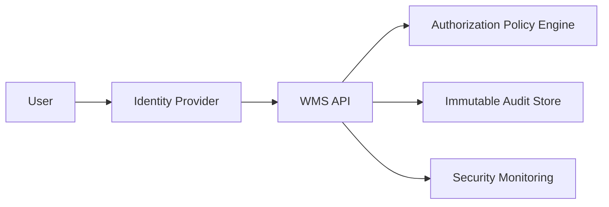

# Security and Compliance Edge Cases

## Sensitive Operation Controls

| Operation | Control |
|---|---|
| Manual inventory override | dual-approval + immutable evidence |
| Shipment cancellation post-handoff | supervisor + transport approval |
| Bulk adjustment upload | signed file + checksum + dry-run validation |

## Threat Scenarios
- Compromised scanner credential attempting fraudulent picks.
- Insider misuse of override permissions.
- Tampering with event replay payloads.

## Defensive Architecture

## Compliance Evidence
- Every high-impact command stores `who/what/why/when`.
- Quarterly access review and least-privilege recertification.
- Regional retention and legal-hold policy applied to audit evidence.
