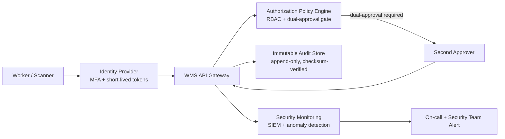

# Security and Compliance Edge Cases

## Failure Mode

Four distinct security failure scenarios are addressed:

**(a) Compromised scanner credential**: a stolen or cloned device session token is used to confirm fraudulent pick completions, generating fake inventory movements and potentially enabling theft.

**(b) Insider abuse of manual override permissions**: a privileged user invokes a manual inventory override or adjustment without providing the required evidence, exploiting a gap in the approval gate enforcement.

**(c) Bulk adjustment upload covering inventory theft**: a large CSV adjustment file is uploaded outside of normal business hours, with quantities that offset physical stock removed by a bad actor.

**(d) Audit log tampering attempt**: a user with direct database access attempts to delete or modify immutable audit records to cover up a fraudulent operation.

---

## Impact

- **Inventory shrinkage**: direct financial loss from goods removed without record.
- **Regulatory non-compliance**: SOX requires accurate inventory records for financial reporting; FDA 21 CFR Part 11 requires immutable electronic records for regulated goods; GDPR requires data protection for any personally identifiable picking/shipping data.
- **Reputational damage**: customer-visible order errors caused by fraudulent picks erode trust.
- **Criminal liability**: deliberate bulk adjustment fraud or audit tampering may constitute criminal offenses.
- **Operational disruption**: frozen credentials and quarantined inventory movements disrupt normal warehouse operations during investigation.

---

## Detection

- **SIEM alert**: pick events confirmed outside the assigned worker's shift hours → alert `AnomalousPickPattern` (Sev-1).
- **Alert**: manual override submitted without required evidence attachment → alert `OverrideWithoutEvidence` (Sev-2).
- **Alert**: bulk adjustment upload without preceding dry-run validation → alert `BulkAdjustmentNoDryRun` (Sev-2).
- **Alert**: audit log write failure or checksum mismatch on immutable store → alert `AuditLogIntegrityBreach` (Sev-1).
- **SIEM alert**: > 5 overrides by the same user in a 1-hour window → alert `OverrideVolumeAnomaly`.
- **Log pattern**: `AUDIT_WRITE_REJECTED` or `AUDIT_TAMPER_DETECTED` in the audit service logs.

---

## Mitigation

**Compromised credential (a):**
1. **Security Team**: immediately revoke the compromised device session token: `POST /devices/{deviceId}/revoke-session`.
2. **Security Team**: freeze all inventory movements confirmed by the compromised session in the last 24 hours: `POST /movements/bulk-quarantine { "session_id": "..." }`.
3. **On-call Engineer**: notify the worker whose credentials were compromised; issue new device pairing.
4. **Incident Commander**: preserve forensic evidence — export all events tied to the session to an immutable evidence store before any remediation.

**Insider override abuse (b):**
5. **Security Team**: flag the override operation as under review; block any downstream effects (shipments, adjustments) pending investigation.
6. **Warehouse Operations Lead**: suspend the user's override permissions pending review.
7. **Inventory Manager**: open an investigation case; assign to a second reviewer for dual-witness review.

**Bulk adjustment fraud (c):**
8. **On-call Engineer**: halt the adjustment job and quarantine the upload file.
9. **Inventory Manager**: trigger a physical audit of the affected SKUs and bins.
10. **Security Team**: cross-reference the upload timestamp with access logs and CCTV if available.

**Audit log tampering (d):**
11. **Security Team**: immediately alert the CISO and open a P1 security incident.
12. **On-call Engineer**: switch audit writes to the backup immutable store (append-only S3 / WORM storage).
13. **Forensics**: capture the exact query or operation that triggered the tamper detection before rolling back any access.

---

## Recovery

1. Rotate all credentials associated with the compromised session or abusive user.
2. Re-audit all inventory transactions affected by the incident: run the reconciliation query for the affected session/user/time window.
3. Apply corrective inventory adjustments with dual-approval (Inventory Manager + Finance sign-off).
4. **Checkpoint**: confirm the audit log is intact for the corrective adjustments; no gaps in the sequence.
5. If regulatory disclosure is required (SOX material misstatement, FDA product recall risk): notify the compliance officer within 24 hours for regulatory filing.
6. Complete a post-incident review with the security team within 5 business days.

---

## Defensive Architecture

---

## Privileged Operations Requiring Dual Approval

| Operation | First Approver | Second Approver | Evidence Required |
|---|---|---|---|
| Manual inventory override > 10 units | Supervisor | Inventory Manager | Photo evidence or damage report |
| Bulk adjustment upload > $500 value | Inventory Manager | Finance | Signed file + checksum + dry-run report |
| Shipment cancellation post-handoff | Supervisor | Transport Manager | Carrier confirmation + reason code |
| User permission escalation | IT Admin | Security Team | Justification ticket |
| Audit log export | IT Admin | Compliance Officer | Legal hold reference number |

---

## Audit Evidence Requirements

| Operation Type | Required Evidence Fields |
|---|---|
| Every pick confirmation | `worker_id`, `device_id`, `bin_id`, `sku_id`, `qty`, `timestamp`, `session_id` |
| Manual override | All pick fields + `approver_id`, `approval_timestamp`, `evidence_attachment_id`, `reason_code` |
| Bulk adjustment | All adjustment fields + `upload_file_checksum`, `dry_run_report_id`, `dual_approver_ids` |
| Credential revocation | `revoked_by`, `revocation_reason`, `affected_session_id`, `timestamp` |
| Audit log access | `accessor_id`, `query_scope`, `legal_hold_id`, `timestamp` |

---

## Regulatory Compliance Checklist

| Requirement | Standard | Control in WMS |
|---|---|---|
| Immutable electronic records | FDA 21 CFR Part 11 | Append-only audit store with checksum verification |
| Access control for electronic signatures | FDA 21 CFR Part 11 | MFA + short-lived device tokens; session binding |
| Accurate inventory for financial reporting | SOX Section 404 | ATP invariant checks; dual-approval for material adjustments |
| Data retention (7 years) | SOX | Audit store with legal-hold policy; automated archival |
| Personal data minimisation | GDPR | Worker IDs are pseudonymised in audit export; no PII in ledger |
| Right to erasure | GDPR | PII stored separately from immutable ledger; erasure of PII layer only |
| Audit trail for all inventory changes | SOX / Internal | Ledger-based design; every change is an append; no in-place updates |

---

## Incident Response Runbook for Security Events

1. **Detect**: SIEM alert fires or manual report received.
2. **Triage** (< 5 min): on-call engineer assesses severity (Sev-1 if active fraud, Sev-2 if historical anomaly).
3. **Contain** (< 15 min): revoke credentials, quarantine movements, freeze affected bins.
4. **Preserve evidence** (< 30 min): export all related events to immutable evidence store before any remediation writes.
5. **Notify**: CISO, Legal, and Compliance Officer for Sev-1 events within 1 hour.
6. **Investigate**: security team + warehouse operations lead conduct joint review within 24 hours.
7. **Remediate**: apply corrective adjustments with dual-approval; re-audit affected transactions.
8. **Disclose**: if material financial impact or regulated goods, file regulatory disclosure within required window.
9. **Post-incident review**: within 5 business days, document root cause, timeline, remediation, and preventive controls.

---

## Prevention

- **Device credential rotation**: device session tokens expire after 8 hours (one shift); re-authentication required at shift start.
- **Dual-approval gate**: all high-impact operations are enforced at the API policy layer, not just the UI.
- **Anomaly detection**: ML-based model on pick patterns (volume, time, location) alerts on deviation > 3σ from historical baseline.
- **Immutable audit log**: implemented as append-only event store with SHA-256 chain hash; any tampering breaks the hash chain and triggers `AuditLogIntegrityBreach`.
- **Least-privilege access**: workers can only confirm picks assigned to their current session; override permissions are role-gated and re-certified quarterly.

---

## Test Scenarios to Add

| # | Scenario | Expected Outcome |
|---|---|---|
| T-SC-01 | Pick confirmed by device session outside worker's shift hours | `AnomalousPickPattern` alert fires; session flagged for review |
| T-SC-02 | Manual override submitted without evidence attachment | API returns `403 EVIDENCE_REQUIRED`; override blocked |
| T-SC-03 | Bulk adjustment uploaded without dry-run | API returns `400 DRY_RUN_REQUIRED`; upload rejected |
| T-SC-04 | Attempt to DELETE from audit_log table | Immutable store rejects; `AuditLogIntegrityBreach` alert fires |
| T-SC-05 | Same user submits 6 overrides in 1 hour | `OverrideVolumeAnomaly` SIEM alert fires; 7th override blocked |
| T-SC-06 | Compromised session token used after revocation | All requests return `401 SESSION_REVOKED`; no movements processed |
