# Architecture Diagram

## Overview and Architectural Principles

The Warehouse Management System (WMS) is designed as a distributed, event-driven platform built on Domain-Driven Design (DDD) bounded contexts. Each bounded context owns its data, enforces its invariants, and communicates asynchronously via domain events published to a managed event bus. The following core patterns govern every architectural decision:

**CQRS (Command Query Responsibility Segregation):** Write operations (commands) flow through transactional command handlers backed by PostgreSQL. Read operations (queries) are served from denormalised read models or Redis caches, allowing independent scaling and optimised query paths without contention on the write store.

**Event Sourcing:** High-value aggregates (InventoryBalance, Reservation, Shipment) emit immutable domain events as the source of truth. Projections re-derive current state from the event log, enabling full audit trails, temporal queries, and replay-based recovery.

**Outbox Pattern:** All domain events are written atomically to an `outbox` table inside the same database transaction as the state change. A dedicated Outbox Relay process polls the table and forwards records to the event bus, guaranteeing at-least-once delivery without distributed two-phase commit.

**DDD Bounded Contexts:** Six first-class bounded contexts (Receiving, Inventory, Allocation, Fulfillment, Shipping, Operations) are mapped to independent deployable services. Cross-context communication uses published domain events only; no shared database joins across context boundaries.

**Bulkhead and Circuit Breaker:** Each external integration (carrier APIs, OMS webhooks, ERP connectors) runs behind an independent connection pool and circuit breaker. A fault in a carrier adapter cannot exhaust resources shared with the core pick-pack path.

---

## Architecture Diagram

```mermaid
flowchart TB
    subgraph Clients[Client Layer]
        RF[RF Scanners]
        WebDash[Web Dashboard]
        MobileApp[Mobile App]
        OMSAPI[OMS / ERP API Clients]
    end

    subgraph Edge[Edge Layer]
        APIGW[API Gateway]
        AuthSvc[Auth Service / JWT Issuer]
        WAF[WAF + Rate Limiter]
    end

    subgraph CoreServices[WMS Core Services]
        RecvSvc[Receiving Service]
        InvSvc[Inventory Service]
        AllocSvc[Allocation Service]
        WaveSvc[Wave Service]
        FulfillSvc[Fulfillment Service]
        ShipSvc[Shipping Service]
        OpsSvc[Operations Service]
        ReportSvc[Reporting Service]
    end

    subgraph Platform[Platform Capabilities]
        RuleEng[Rule Engine]
        OutboxRelay[Outbox Relay Worker]
        AuditPipe[Audit Pipeline]
        PolicyEng[AuthZ Policy Engine]
    end

    subgraph WorkerPools[Async Worker Pools]
        WaveWorker[Wave Planning Worker]
        AllocWorker[Allocation Worker]
        ReplenWorker[Replenishment Worker]
        LabelWorker[Label Generation Worker]
        ReconcileWorker[Reconciliation Worker]
    end

    subgraph DataInfra[Data & Messaging Layer]
        PG[(PostgreSQL Cluster\npartitioned by warehouse_id)]
        Redis[(Redis Cache\nread models + locks)]
        Kafka[(Kafka Event Bus)]
        S3[(S3 Object Store\nlabels + manifests + reports)]
    end

    subgraph Analytics[Analytics Pipeline]
        Kinesis[Kinesis Firehose]
        DataLake[S3 Data Lake]
        AthenaRedshift[Athena / Redshift]
        Grafana[Grafana Dashboards]
    end

    subgraph External[External Systems]
        CarrierAPI[Carrier APIs\nFedEx / UPS / DHL]
        OMSSYS[OMS System]
        ERPSYS[ERP System]
        TMSSYS[TMS System]
    end

    RF --> WAF
    WebDash --> WAF
    MobileApp --> WAF
    OMSAPI --> WAF
    WAF --> APIGW
    APIGW --> AuthSvc
    AuthSvc --> APIGW

    APIGW --> RecvSvc
    APIGW --> InvSvc
    APIGW --> AllocSvc
    APIGW --> WaveSvc
    APIGW --> FulfillSvc
    APIGW --> ShipSvc
    APIGW --> OpsSvc
    APIGW --> ReportSvc

    RecvSvc --> PG
    InvSvc --> PG
    AllocSvc --> PG
    WaveSvc --> PG
    FulfillSvc --> PG
    ShipSvc --> PG
    OpsSvc --> PG

    RecvSvc --> Redis
    InvSvc --> Redis
    AllocSvc --> Redis
    FulfillSvc --> Redis

    RecvSvc --> PG
    InvSvc --> PG
    AllocSvc --> RuleEng
    OpsSvc --> PolicyEng

    OutboxRelay --> PG
    OutboxRelay --> Kafka

    Kafka --> WaveWorker
    Kafka --> AllocWorker
    Kafka --> ReplenWorker
    Kafka --> LabelWorker
    Kafka --> ReconcileWorker
    Kafka --> AuditPipe

    WaveWorker --> PG
    AllocWorker --> PG
    ReplenWorker --> PG
    LabelWorker --> S3
    ReconcileWorker --> PG

    ShipSvc --> CarrierAPI
    RecvSvc --> ERPSYS
    AllocSvc --> OMSSYS
    ShipSvc --> TMSSYS

    Kafka --> Kinesis
    Kinesis --> DataLake
    DataLake --> AthenaRedshift
    AthenaRedshift --> Grafana
    ReportSvc --> AthenaRedshift
```

---

## Architecture Decision Records (ADR)

### ADR-001: Use PostgreSQL with Table Partitioning (vs NoSQL / NewSQL)

**Status:** Accepted

**Context:** WMS requires strict ACID transactions for inventory mutations (receipts, reservations, picks). Inventory balance must never go negative; concurrent workers must safely decrement stock with optimistic or pessimistic locking.

**Decision:** Use PostgreSQL 15+ with declarative range partitioning on `warehouse_id` and `created_at`. Connection pooling via PgBouncer. Read replicas for reporting queries.

**Rationale:** Relational integrity enforces foreign-key invariants across Bin, SKU, LotNumber, and InventoryUnit tables. Partitioning by `warehouse_id` bounds blast radius of long-running queries and allows partition pruning. JSONB columns handle flexible attribute payloads (SKU metadata, carrier labels) without sacrificing index-ability.

**Alternatives Rejected:** DynamoDB (no multi-table transactions without heavy application logic), CockroachDB (licensing cost, operational complexity at target scale), MongoDB (document model poorly fits ledger-style sequential writes).

---

### ADR-002: Outbox Pattern for Event Publication (vs Direct Kafka Publish)

**Status:** Accepted

**Context:** Publishing events directly to Kafka inside a service call creates a dual-write problem: if the DB commit succeeds but the Kafka produce fails, the event is lost and the system is inconsistent.

**Decision:** Write events atomically to an `outbox` table in the same transaction as state changes. A dedicated `OutboxRelay` worker polls the table (with a FOR UPDATE SKIP LOCKED cursor) and publishes to Kafka, then marks records as delivered.

**Rationale:** Guarantees at-least-once delivery with no data loss. Consumers are idempotent, so duplicates (on relay restart) are safe. The outbox table also serves as a replayable audit trail.

**Alternatives Rejected:** Kafka transactions with exactly-once semantics (requires co-location of DB and Kafka producers, complex failure modes), change data capture via Debezium (additional operational complexity, requires WAL-level access).

---

### ADR-003: CQRS for Inventory Read/Write Separation

**Status:** Accepted

**Context:** Inventory balance queries are called by the dashboard, scanner apps, allocation engine, and reporting service concurrently, with latency requirements under 50 ms. Write throughput during peak receiving/wave-release events can spike to thousands of mutations per minute.

**Decision:** Command handlers write to normalised PostgreSQL tables. Read models are maintained in Redis (current balances) and denormalised PostgreSQL projections (historical ledger views). Queries are served from these read stores exclusively.

**Rationale:** Decouples read latency optimisation from write correctness. Redis balance cache eliminates join-heavy queries for the most common ATP (Available-to-Promise) check. Projections can be rebuilt from the event log if they drift.

**Alternatives Rejected:** Single CRUD model (read/write contention degrades throughput), GraphQL federation layer without CQRS (still hits the same write tables for reads).

---

### ADR-004: Dedicated Zone-Picking Wave Strategy (vs Global Allocation)

**Status:** Accepted

**Context:** Large warehouses have multiple zones (bulk storage, pick faces, cold chain, hazmat). Sending pickers to random zones increases travel time and creates congestion at zone transitions.

**Decision:** The Wave Service plans waves per zone cluster. Each WaveLine is assigned to a zone-specific PickList. Workers in a zone pick only their zone's lines; sort-and-consolidate stations merge multi-zone orders before packing.

**Rationale:** Reduces average pick travel distance by ~40% (industry benchmark). Enables parallel pick execution across zones. Simplifies zone-level SLA tracking and allows zone-specific staffing rules.

**Alternatives Rejected:** Global single-pass allocation (poor travel efficiency), aisle-interleave picking without zone boundaries (complex collision avoidance, harder to staff).

---

### ADR-005: Carrier API Circuit Breaker Pattern

**Status:** Accepted

**Context:** Carrier APIs (FedEx, UPS, DHL) are external dependencies with variable SLAs. A carrier outage during peak shipping can block the entire label-generation and shipment-confirmation path.

**Decision:** Wrap every carrier API call in a circuit breaker (Resilience4j / custom Go implementation). States: CLOSED (normal), OPEN (fail fast after threshold), HALF-OPEN (probe recovery). On OPEN, route to a fallback queue that retries asynchronously and alerts operations.

**Rationale:** Prevents carrier latency from cascading into fulfillment service thread exhaustion. Fallback queue allows shipments to be manifested later without operator intervention for transient outages.

**Alternatives Rejected:** Simple timeout + retry (does not prevent thundering herd on recovery), manual carrier failover (too slow, operator-dependent).

---

## Technology Stack

| Layer | Technology | Rationale |
|---|---|---|
| API Services | Go 1.22 (Gin / Fiber) | High throughput, low latency, compiled binary deployment |
| Async Workers | Go 1.22 goroutine pools | Same language, share domain packages, efficient concurrency |
| Database | PostgreSQL 15 + PgBouncer | ACID transactions, partitioning, JSONB flexibility |
| Cache / Locks | Redis 7 (Cluster mode) | Sub-millisecond balance reads, distributed locks for reservation |
| Event Bus | Apache Kafka (MSK) | Durable, replayable, high-throughput topic per domain event |
| Object Store | AWS S3 | Labels, manifests, reports, archive |
| API Gateway | AWS API Gateway + Kong | Rate limiting, JWT validation, routing |
| Auth | Auth0 / custom JWT issuer | RBAC with warehouse-scoped claims |
| Container Platform | Kubernetes (EKS) | HPA, pod isolation, rolling deployments |
| Observability | Prometheus + Grafana + X-Ray | Metrics, distributed tracing, alerting |
| CI/CD | GitHub Actions + ArgoCD | GitOps deployment, canary releases |
| IaC | Terraform + Helm | Reproducible infra, environment parity |

---

## Service Interaction Matrix

| Caller ↓ / Callee → | Receiving | Inventory | Allocation | Wave | Fulfillment | Shipping | Operations | Reporting |
|---|---|---|---|---|---|---|---|---|
| **Receiving** | — | Write (receipt ledger) | — | — | — | — | Write (discrepancy) | Event |
| **Inventory** | Read (ASN) | — | Read (ATP) | — | Read (balance) | — | Event | Event |
| **Allocation** | — | Write (reserve) | — | Write (wave lines) | — | — | Event | Event |
| **Wave** | — | Read (bins) | Read (reservations) | — | Write (pick lists) | — | — | Event |
| **Fulfillment** | — | Write (pick confirm) | Write (release reserve) | Read (pick list) | — | Write (pack close) | Write (short-pick) | Event |
| **Shipping** | — | — | — | — | Read (pack session) | — | Write (carrier fail) | Event |
| **Operations** | Read | Read | Read | Read | Read | Read | — | Event |
| **Reporting** | Read | Read | Read | Read | Read | Read | Read | — |

---

## Scalability Architecture

- **Stateless API pods:** All session state in Redis or JWT claims. API pods scale horizontally behind the load balancer with zero warm-up cost.
- **Partitioning by warehouse_id:** PostgreSQL tables and Kafka topics partitioned by `warehouse_id`. Queries are routed to the correct partition shard, bounding cross-tenant interference.
- **Worker autoscaling on queue depth:** Kafka consumer group lag metrics trigger HPA scale-out for wave, allocation, and label workers.
- **Redis cluster mode:** Inventory balance keys sharded across Redis nodes. Lock keys for reservation use Redlock protocol.
- **Read replica offloading:** Reporting service and dashboard queries routed to read replicas; write path unaffected.

---

## Failure Isolation Strategy

- **Bulkhead pattern:** Carrier adapter, OMS webhook consumer, and ERP sync each run in isolated goroutine pools with independent concurrency limits. Saturation of one pool cannot starve others.
- **Circuit breakers:** Applied to all external HTTP calls (carrier, OMS, ERP). Thresholds: 5 failures in 10 seconds → OPEN; 30-second probe interval.
- **Retry budgets:** Each service has a configured maximum retry budget per operation. Retries use exponential backoff with jitter to prevent thundering herd.
- **Dead-letter queues:** All async worker failure paths route to a per-topic DLQ. Operations team receives alert; replay tooling available from DLQ.
- **Graceful degradation:** If Reporting Service is unavailable, all other services continue operating. Reporting events accumulate in Kafka until the service recovers.
- **Health gates on wave release:** Wave Service checks downstream Fulfillment Service health before releasing large waves, preventing pick list accumulation without available pickers.
