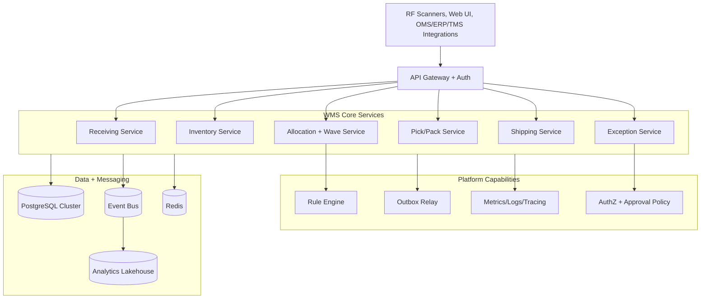

# Architecture Diagram

## Architecture Decisions
- Command-side consistency anchored in OLTP transactions + outbox.
- Read models may lag; command truth remains deterministic per partition key.
- Exception management is first-class service, not ad-hoc side effect.
