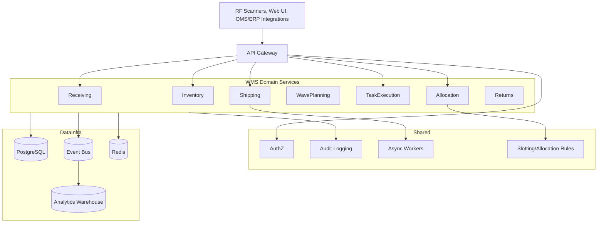

# Architecture Diagram

```mermaid
flowchart TB
    Channels[RF Scanners, Web UI, OMS/ERP Integrations] --> Edge[API Gateway]

    subgraph Services[WMS Domain Services]
      Receiving
      Inventory
      Allocation
      WavePlanning
      TaskExecution
      Shipping
      Returns
    end

    Edge --> Receiving
    Edge --> Inventory
    Edge --> Allocation
    Edge --> TaskExecution
    Edge --> Shipping

    subgraph Shared
      Auth[AuthZ]
      Audit[Audit Logging]
      Jobs[Async Workers]
      Rules[Slotting/Allocation Rules]
    end

    Edge --> Auth
    Allocation --> Rules
    Services --> Audit
    Shipping --> Jobs

    subgraph DataInfra
      DB[(PostgreSQL)]
      MQ[(Event Bus)]
      Cache[(Redis)]
      BI[(Analytics Warehouse)]
    end

    Services --> DB
    Services --> MQ
    Services --> Cache
    MQ --> BI
```
