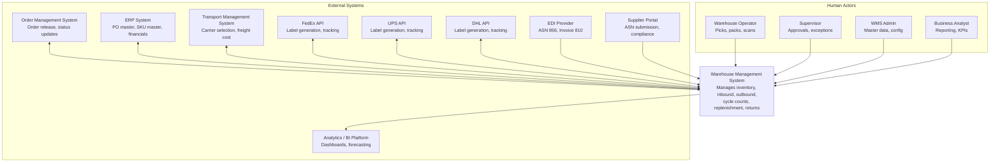
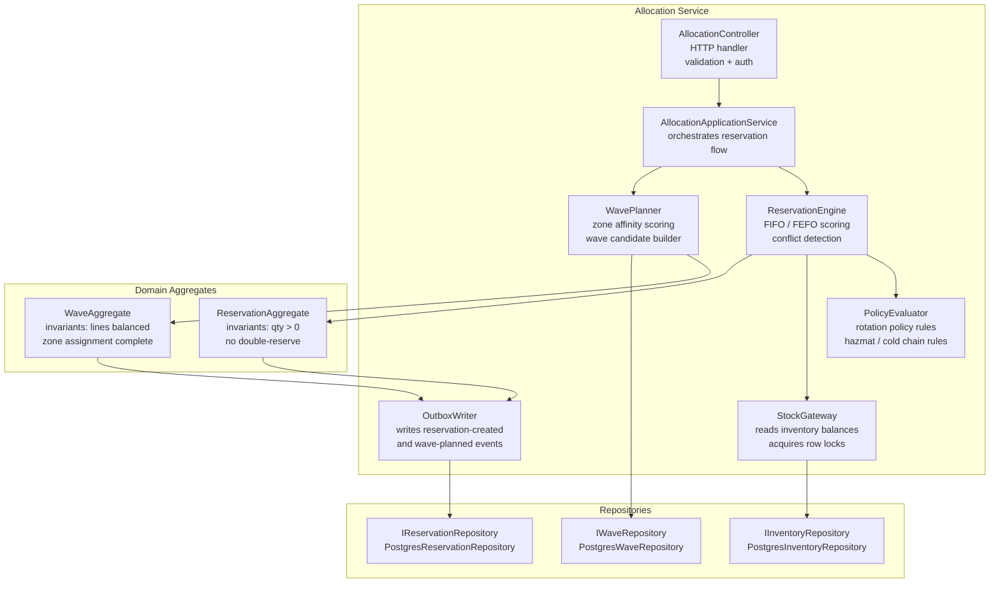
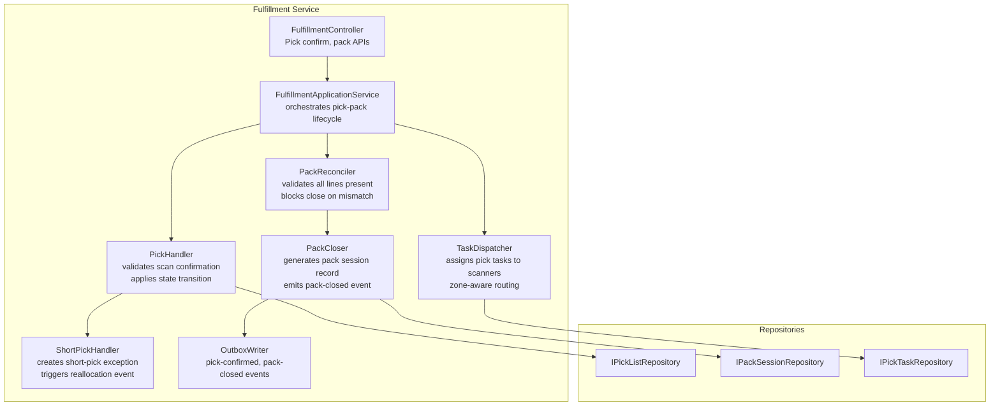
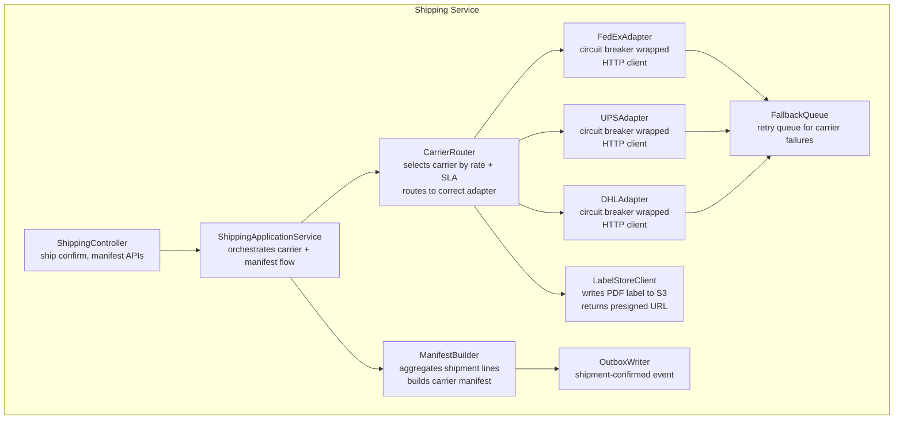

# C4 Diagrams

## Overview

This document presents C4 model diagrams at three zoom levels for the Warehouse Management System. The C4 model (Context, Container, Component, Code) provides a consistent, hierarchical way to communicate software architecture to different audiences: business stakeholders (C1), technical architects (C2), and developers (C3/C4).

---

## C1 — System Context Diagram

The C1 diagram shows the WMS as a black box in its environment, with all external actors and systems that interact with it.

---

## C2 — Container Diagram

The C2 diagram expands the WMS into its major deployable containers, showing how they communicate.

```mermaid
flowchart TB
    subgraph ClientTier[Client Tier]
        WebUI[Web Dashboard\nReact SPA\nSupervisors & Admins]
        ScannerApp[Mobile Scanner App\nReact Native\nWarehouse Operators]
        APIClient[API Clients\nOMS / ERP / TMS]
    end

    subgraph EdgeTier[Edge Tier]
        APIGW[API Gateway\nAWS API GW + Kong\nRouting, rate limit, JWT verify]
        AuthSvc[Auth Service\nJWT issuer, RBAC\nwarehouse-scoped claims]
    end

    subgraph ServiceTier[Service Tier — WMS Core]
        RecvSvc[Receiving Service\nASN validation, receipt recording\nputaway planning]
        InvSvc[Inventory Service\nBalance ledger, ATP queries\ninventory adjustments]
        AllocSvc[Allocation Service\nReservation engine\nFIFO/FEFO policy]
        WaveSvc[Wave Service\nWave planning, pick list gen\nzone assignment]
        FulfillSvc[Fulfillment Service\nPick execution, pack reconciliation\nshort-pick handling]
        ShipSvc[Shipping Service\nCarrier label gen, manifesting\nshipment confirmation]
        OpsSvc[Operations Service\nCycle counting, replenishment\nreturns, crossdocking]
        ReportSvc[Reporting Service\nKPI dashboards, exports\nSLA metrics]
    end

    subgraph WorkerTier[Async Worker Tier]
        OutboxWorker[Outbox Relay Worker\nPolls outbox table\npublishes to Kafka]
        WaveWorker[Wave Planning Worker\nConsumes order-released events\ngenerates wave candidates]
        AllocWorker[Allocation Worker\nConsumes allocation-requested\nreserves inventory]
        LabelWorker[Label Gen Worker\nConsumes pack-closed events\ncalls carrier APIs]
        ReconcileWorker[Reconcile Worker\nPeriodic ledger reconciliation]
        ReplenWorker[Replenishment Worker\nConsumes low-stock events\ncreates replen tasks]
    end

    subgraph DataTier[Data Tier]
        PG[(PostgreSQL 15\nOLTP — partitioned\nby warehouse_id)]
        PGReplica[(PostgreSQL\nRead Replica\nReporting queries)]
        Redis[(Redis 7 Cluster\nBalance cache\nDistributed locks)]
        Kafka[(Apache Kafka MSK\nDomain event bus\nper-topic partitioning)]
        S3[(AWS S3\nLabels, manifests\nReports, archive)]
    end

    subgraph AnalyticsTier[Analytics Tier]
        Firehose[Kinesis Firehose\nEvent stream ingestion]
        DataLake[S3 Data Lake\nParquet / Delta format]
        Athena[Amazon Athena\nAd-hoc SQL queries]
        Redshift[Amazon Redshift\nBI aggregations]
        GrafanaDash[Grafana\nOperational dashboards]
    end

    WebUI --> APIGW
    ScannerApp --> APIGW
    APIClient --> APIGW
    APIGW --> AuthSvc
    AuthSvc --> APIGW

    APIGW --> RecvSvc
    APIGW --> InvSvc
    APIGW --> AllocSvc
    APIGW --> WaveSvc
    APIGW --> FulfillSvc
    APIGW --> ShipSvc
    APIGW --> OpsSvc
    APIGW --> ReportSvc

    RecvSvc --> PG
    InvSvc --> PG
    AllocSvc --> PG
    WaveSvc --> PG
    FulfillSvc --> PG
    ShipSvc --> PG
    OpsSvc --> PG
    ReportSvc --> PGReplica

    RecvSvc --> Redis
    InvSvc --> Redis
    AllocSvc --> Redis

    OutboxWorker --> PG
    OutboxWorker --> Kafka

    Kafka --> WaveWorker
    Kafka --> AllocWorker
    Kafka --> LabelWorker
    Kafka --> ReconcileWorker
    Kafka --> ReplenWorker

    WaveWorker --> PG
    AllocWorker --> PG
    LabelWorker --> S3
    ReconcileWorker --> PG
    ReplenWorker --> PG

    Kafka --> Firehose
    Firehose --> DataLake
    DataLake --> Athena
    DataLake --> Redshift
    ReportSvc --> Athena
    Athena --> GrafanaDash
    Redshift --> GrafanaDash
```

---

## C3 — Component Diagrams

### C3a: Allocation Service — Internal Components

### C3b: Fulfillment Service — Internal Components

### C3c: Shipping Service — Internal Components

---

## Container Responsibilities

| Container | Primary Responsibility | Owned Data | Publishes Events | Consumes Events |
|---|---|---|---|---|
| Receiving Service | ASN validation, receipt recording, putaway planning | receipts, putaway_tasks | receipt-created, putaway-assigned | asn-released (ERP) |
| Inventory Service | Balance ledger, ATP queries, adjustments | inventory_balances, inventory_ledger | balance-updated, adjustment-posted | receipt-created, pick-confirmed |
| Allocation Service | Reservation, FIFO/FEFO, conflict resolution | reservations | reservation-created, reservation-released | order-released (OMS) |
| Wave Service | Wave planning, pick list generation, zone assignment | waves, wave_lines, pick_lists | wave-planned, pick-list-generated | reservation-created |
| Fulfillment Service | Pick execution, pack reconciliation | pick_tasks, pack_sessions | pick-confirmed, pack-closed | pick-list-generated |
| Shipping Service | Carrier label gen, manifest, shipment confirmation | shipments, tracking_labels | shipment-confirmed | pack-closed |
| Operations Service | Cycle count, replenishment, returns, crossdock | cycle_counts, replenishment_tasks, returns | cycle-count-adjusted, replenishment-triggered | balance-updated, pick-confirmed |
| Reporting Service | KPI aggregation, exports, SLA metrics | read-only projections | — | all domain events |
| Outbox Relay Worker | Poll outbox, forward to Kafka | outbox table (shared) | — | — |
| Auth Service | JWT issuance, RBAC validation | users, roles, permissions | — | — |

---

## Data Flow Between Containers

**Inbound (Receiving) Path:**
ERP/EDI → Receiving Service (ASN validation) → PostgreSQL (receipt ledger write) → Outbox → Kafka (`receipt-created`) → Inventory Service (balance update) → Kafka (`balance-updated`) → Operations Service (putaway task trigger).

**Outbound (Fulfillment) Path:**
OMS → Allocation Service (reserve stock) → Kafka (`reservation-created`) → Wave Service (build wave + pick list) → Kafka (`pick-list-generated`) → Fulfillment Service (scanner picks) → Kafka (`pack-closed`) → Shipping Service (label + manifest) → Carrier API → Kafka (`shipment-confirmed`) → OMS (status callback).

**Inventory Query Path:**
Scanner App / Web Dashboard → API Gateway → Inventory Service → Redis (balance cache, <5 ms) → response. Cache miss falls through to PostgreSQL read replica.

**Analytics Path:**
All services write domain events to Kafka → Kinesis Firehose (buffered, 60-second windows) → S3 Data Lake (Parquet) → Athena / Redshift → Grafana dashboards and BI reports.
