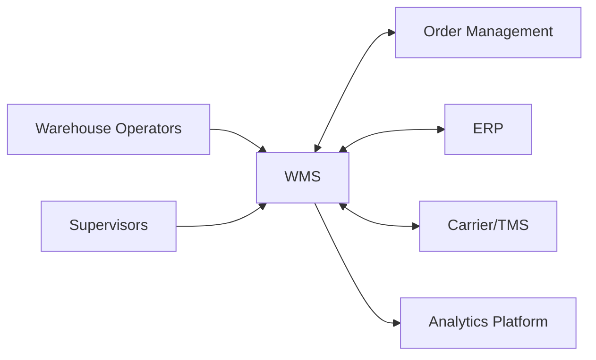
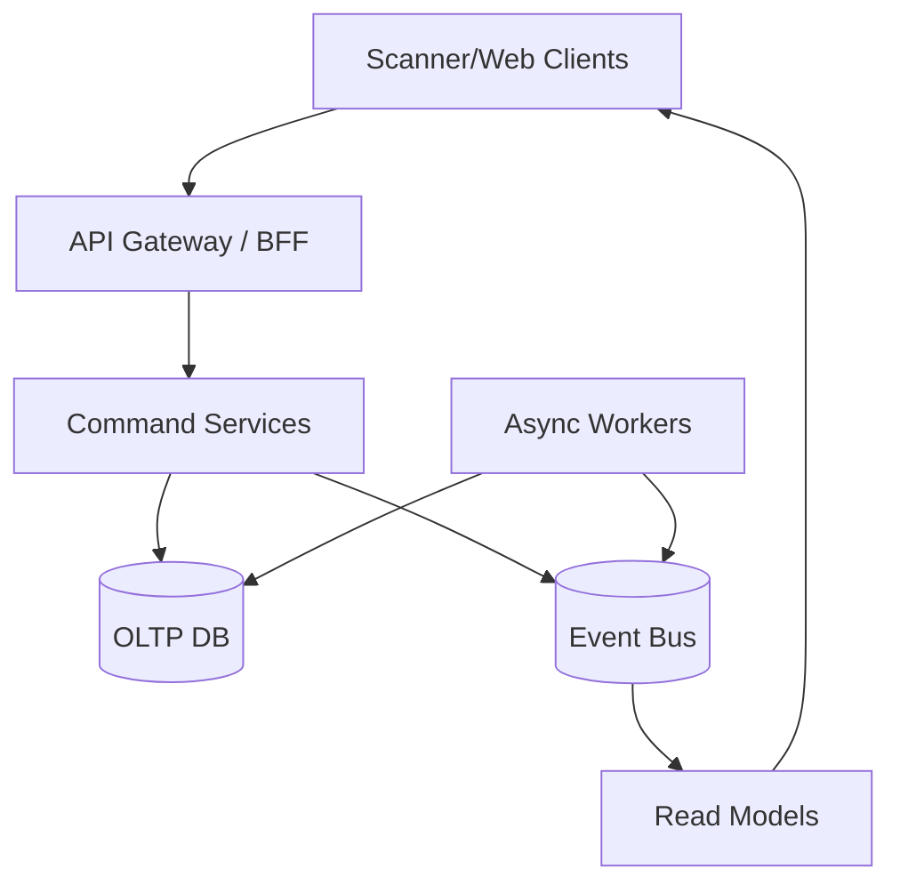
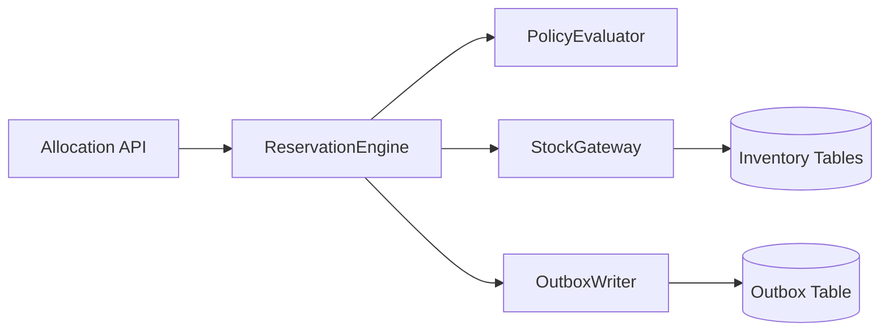

# C4 Diagrams

## C1 - System Context

## C2 - Container View

## C3 - Key Components (Allocation Container)

## Notes
- C1 clarifies ownership boundaries.
- C2 clarifies data flow and async split.
- C3 identifies implementation units for allocation critical path.
