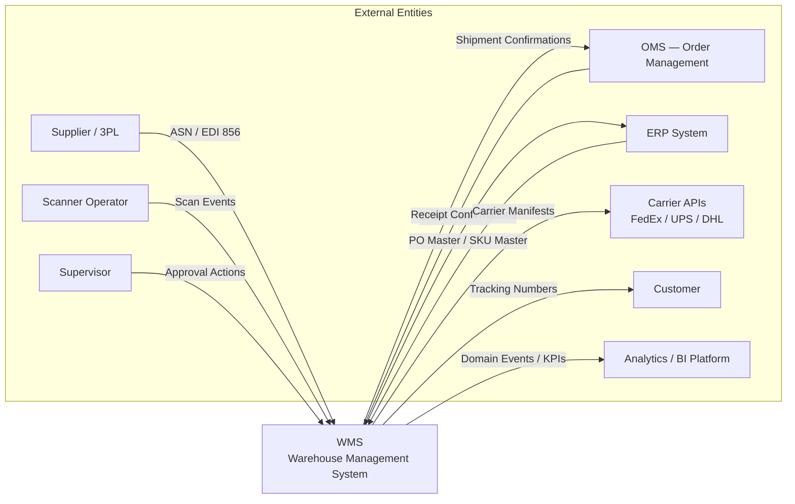
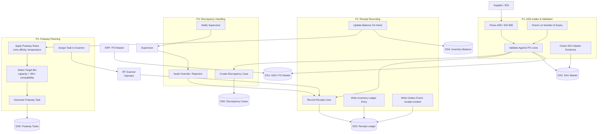
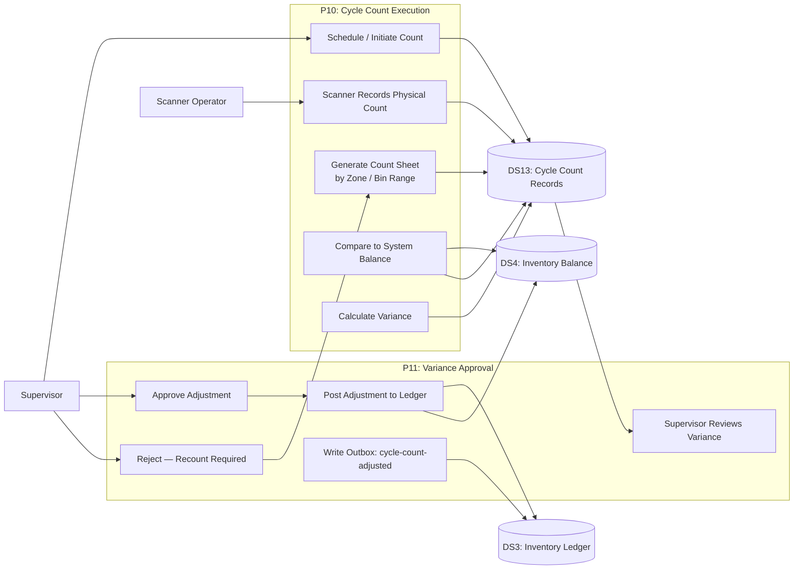
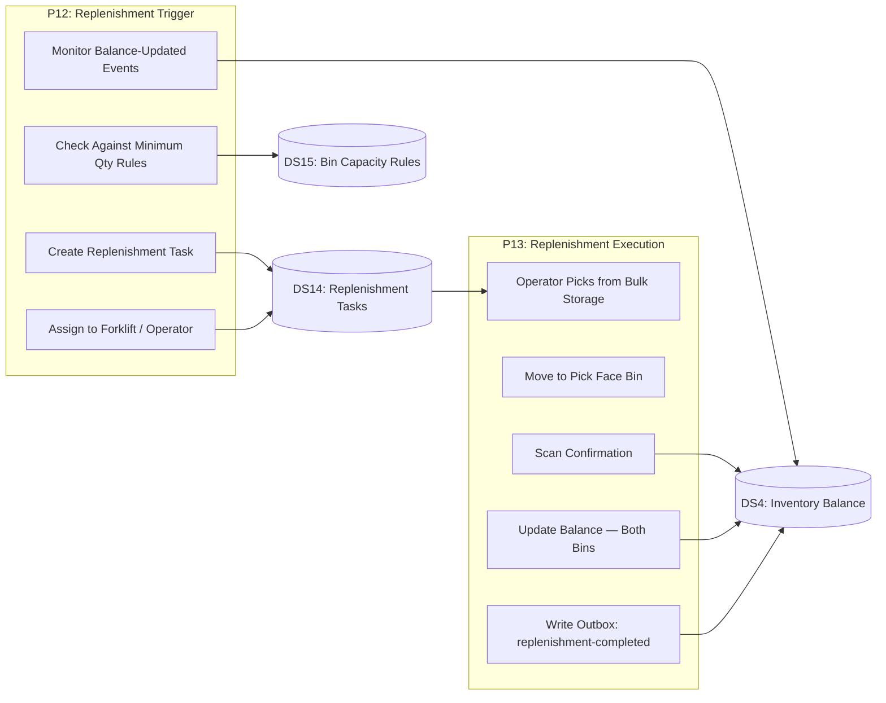
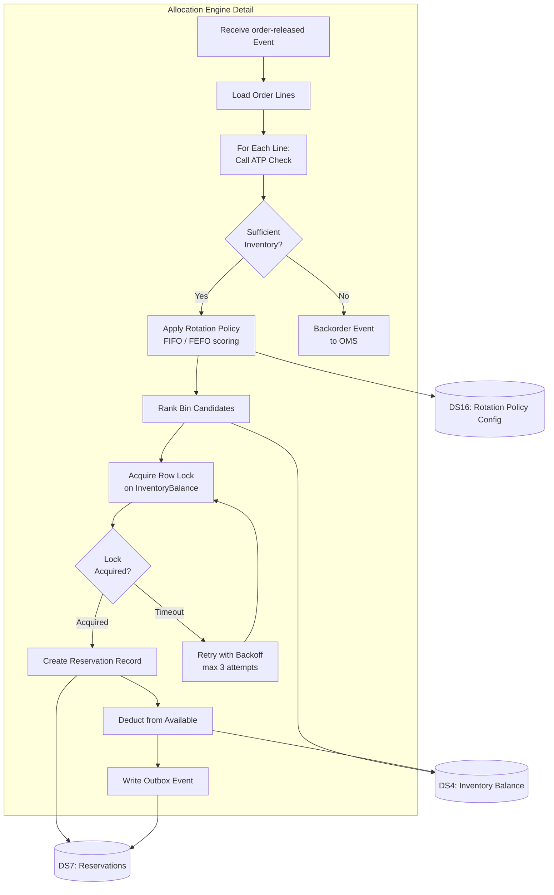

# Data Flow Diagrams

## Overview

This document describes data flows through the Warehouse Management System at multiple levels of abstraction. Level 0 shows the system boundary with all external entities. Level 1 diagrams decompose each major process area (Inbound, Outbound, Cycle Count, Replenishment). Level 2 diagrams provide further decomposition of the Allocation process. Data store definitions, external entity integrations, and data quality checkpoints are also documented.

All data flows carry a `correlation_id` and `actor_id` for end-to-end traceability. All writes to the OLTP database trigger an outbox entry that propagates the change as a domain event to the event bus.

---

## DFD Level 0 — System Overview

---

## DFD Level 1 — Inbound Data Flow

---

## DFD Level 1 — Outbound Data Flow

```mermaid
flowchart TB
    OMS[OMS\nOrder Management]
    Scanner[RF Scanner\nOperator]
    CarrierAPI[Carrier API]
    Customer[Customer]

    subgraph P5[P5: Order Release & Allocation]
        P5a[Receive Order Release Event]
        P5b[Check ATP — Available To Promise]
        P5c[Apply Rotation Policy FIFO/FEFO]
        P5d[Create Reservation Records]
        P5e[Write Outbox: reservation-created]
    end

    subgraph P6[P6: Wave Planning]
        P6a[Group Reservations by Zone]
        P6b[Apply Zone Balancing Rules]
        P6c[Generate Wave + WaveLines]
        P6d[Generate PickLists per Zone]
        P6e[Release Wave to Scanners]
    end

    subgraph P7[P7: Pick Execution]
        P7a[Assign PickTask to Scanner]
        P7b[Validate Scan: SKU + Lot + Bin]
        P7c[Confirm Pick Quantity]
        P7d[Handle Short Pick Exception]
        P7e[Write Outbox: pick-confirmed]
    end

    subgraph P8[P8: Pack Reconciliation]
        P8a[Open Pack Session]
        P8b[Add Picks to Session]
        P8c[Validate All Lines Present]
        P8d[Weigh and Seal Container]
        P8e[Close Pack Session]
        P8f[Write Outbox: pack-closed]
    end

    subgraph P9[P9: Ship Confirmation]
        P9a[Request Carrier Label]
        P9b[Build Manifest]
        P9c[Confirm Shipment]
        P9d[Write Outbox: shipment-confirmed]
        P9e[Callback to OMS]
    end

    DS4[(DS4: Inventory Balance)]
    DS7[(DS7: Reservations)]
    DS8[(DS8: Waves / WaveLines)]
    DS9[(DS9: PickLists / PickTasks)]
    DS10[(DS10: Pack Sessions)]
    DS11[(DS11: Shipments)]
    DS12[(DS12: Carrier Labels — S3)]

    OMS --> P5a
    P5a --> P5b
    P5b --> DS4
    P5c --> DS4
    P5d --> DS7
    P5e --> DS7

    DS7 --> P6a
    P6b --> P6c
    P6c --> DS8
    P6d --> DS9
    P6e --> Scanner

    Scanner --> P7a
    P7a --> DS9
    P7b --> DS9
    P7c --> DS9
    P7d --> DS9
    P7e --> DS9

    DS9 --> P8a
    P8b --> DS10
    P8c --> DS9
    P8e --> DS10
    P8f --> DS10

    DS10 --> P9a
    P9a --> CarrierAPI
    CarrierAPI --> P9b
    P9b --> DS11
    P9c --> DS11
    P9d --> DS11
    P9d --> DS12
    P9e --> OMS
    P9e --> Customer
```

---

## DFD Level 1 — Cycle Count Data Flow

---

## DFD Level 1 — Replenishment Data Flow

---

## DFD Level 2 — Allocation Process Decomposition

---

## Data Stores

| Store ID | Name | Type | Access Pattern | Retention | Notes |
|---|---|---|---|---|---|
| DS1 | ASN / PO Master | PostgreSQL | Read by receiving service; written by ERP sync | 7 years (compliance) | Partitioned by warehouse_id |
| DS2 | SKU Master | PostgreSQL + Redis cache | High-frequency reads (every scan); infrequent writes | Indefinite | Redis cache TTL 1 hour; invalidated on update |
| DS3 | Inventory Ledger | PostgreSQL (append-only) | Write-heavy (every stock mutation); read for audits | 7 years | Immutable rows; partitioned by warehouse_id + month |
| DS4 | Inventory Balance | PostgreSQL + Redis | Write: every stock event; Read: every scan (ATP) | Indefinite (live) | Redis cache for ATP; PG is source of truth |
| DS5 | Discrepancy Cases | PostgreSQL | Written on mismatch; read by supervisors | 2 years | Linked to receipt_id |
| DS6 | Putaway Tasks | PostgreSQL | Written on receipt; read by scanner app | 90 days active; 2 years archive | Status-driven; completed tasks archived |
| DS7 | Reservations | PostgreSQL | Write on allocation; read by wave planner | Until released | Optimistic lock with version column |
| DS8 | Waves / WaveLines | PostgreSQL | Write on wave plan; read by fulfillment | 90 days | Partitioned by warehouse_id |
| DS9 | PickLists / PickTasks | PostgreSQL | Write on wave release; high-frequency read by scanners | 90 days | Indexed by scanner_id, wave_id, zone_id |
| DS10 | Pack Sessions | PostgreSQL | Write on pack open/close; read by shipping | 90 days | Links pick tasks to containers |
| DS11 | Shipments | PostgreSQL | Write on confirm; read by OMS callback | 7 years | Partitioned by shipped_date |
| DS12 | Carrier Labels | S3 | Write once on label gen; read for printing | 7 years | PDF stored as `{shipment_id}/{tracking_number}.pdf` |
| DS13 | Cycle Count Records | PostgreSQL | Write on scan; read by supervisor | 5 years | Variance threshold triggers approval workflow |
| DS14 | Replenishment Tasks | PostgreSQL | Write on trigger; read by forklift operators | 30 days active | Deduplicated by sku+bin |
| DS15 | Bin Capacity Rules | PostgreSQL + Redis | Read by putaway planner and replen trigger | Indefinite | Config-driven; rarely updated |
| DS16 | Rotation Policy Config | PostgreSQL + Redis | Read by allocation engine | Indefinite | Per-SKU or per-zone overrides |

---

## External Entity Integration Details

| Entity | Integration Method | Protocol | Direction | Frequency | Notes |
|---|---|---|---|---|---|
| Supplier / EDI Provider | EDI 856 ASN, EDI 810 Invoice | AS2 / SFTP | Inbound | Per shipment | Anti-corruption layer translates EDI to WMS ASN model |
| OMS (Order Management) | REST Webhook + Event subscription | HTTPS / Kafka | Bi-directional | Near real-time | OMS pushes order-released; WMS pushes shipment-confirmed |
| ERP System | REST API polling + webhook | HTTPS | Bi-directional | 15-minute sync for SKU/PO; immediate for receipt confirm | Anti-corruption layer normalises ERP product codes to SkuCode |
| Carrier APIs (FedEx/UPS/DHL) | REST API | HTTPS | Outbound | Per shipment | Circuit breaker; fallback queue; retry with backoff |
| Analytics / BI Platform | Kafka → Kinesis Firehose | Event streaming | Outbound | Continuous | All domain events streamed; 60-second Firehose buffer |
| Scanner Devices | Mobile App + WebSocket | WSS / HTTPS | Bi-directional | Per scan (sub-second) | Scanner sends scan events; WMS pushes task assignments |

---

## Critical Data Quality Checkpoints

| Checkpoint | Location in Flow | Validation Rule | On Failure Action |
|---|---|---|---|
| ASN Quantity vs PO Tolerance | P1b — ASN Validation | Received qty within ±tolerance% of PO qty | Raise discrepancy case; block receipt close |
| SKU Master Existence | P1c — SKU Check | SKU code must exist in SKU Master | Reject receipt line; notify supervisor |
| Lot Expiry Date | P1d — Lot Validation | Expiry date must be ≥ today + minimum shelf life | Reject lot; flag for quarantine |
| ATP Check Before Reservation | A3 — Allocation | available = on_hand − reserved > 0 | Backorder event to OMS |
| Scan Confirmation Match | P7b — Pick Execution | Scanned barcode matches expected SKU + Lot + Bin | Reject scan; reassign task |
| Pack Weight Tolerance | P8d — Pack Close | Actual weight within ±5% of system weight | Hold session; trigger manual review |
| Carrier Label Stored | P9a — Ship Confirm | S3 presigned URL must be resolvable | Block shipment confirm |
| Cycle Count Variance Threshold | P10e — Variance Calc | Variance > configured threshold | Require supervisor approval before adjustment |
| Duplicate Reservation Guard | A9 — Reserve | No existing active reservation for same order_line_id | Idempotency key check; return existing reservation |
