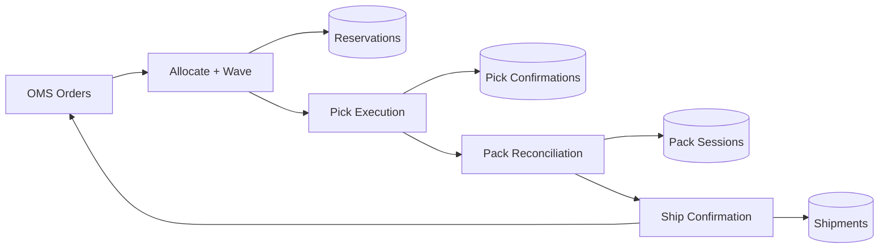
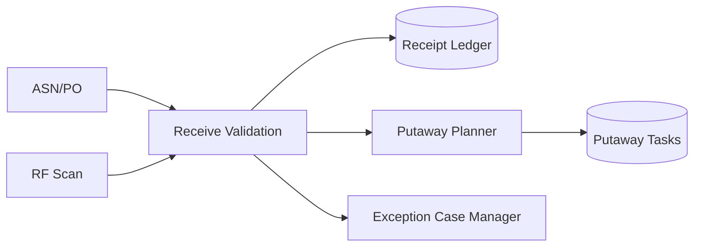

# Data Flow Diagrams

## DFD Level 0 - Fulfillment Data Flow

## DFD Level 1 - Receiving Flow

## Data Controls
- All writes carry `correlation_id`, `actor_id`, and reason metadata.
- Outbox ensures event publication after commit only.
- Reconciliation jobs compare ledger totals with balances.
