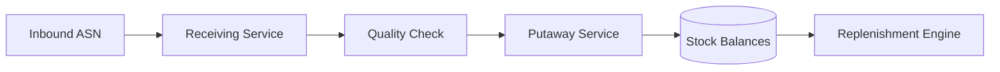
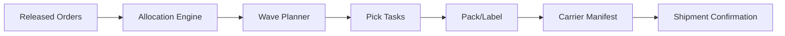

# Data Flow Diagrams

## Inbound and Inventory Data Flow

```mermaid
flowchart LR
    ASN[Inbound ASN] --> Receive[Receiving Service]
    Receive --> QC[Quality Check]
    QC --> Putaway[Putaway Service]
    Putaway --> Stock[(Stock Balances)]
    Stock --> Replenish[Replenishment Engine]
```

## Order Fulfillment Data Flow

```mermaid
flowchart LR
    Orders[Released Orders] --> Allocate[Allocation Engine]
    Allocate --> Wave[Wave Planner]
    Wave --> Tasks[Pick Tasks]
    Tasks --> Pack[Pack/Label]
    Pack --> Ship[Carrier Manifest]
    Ship --> Confirm[Shipment Confirmation]
```
