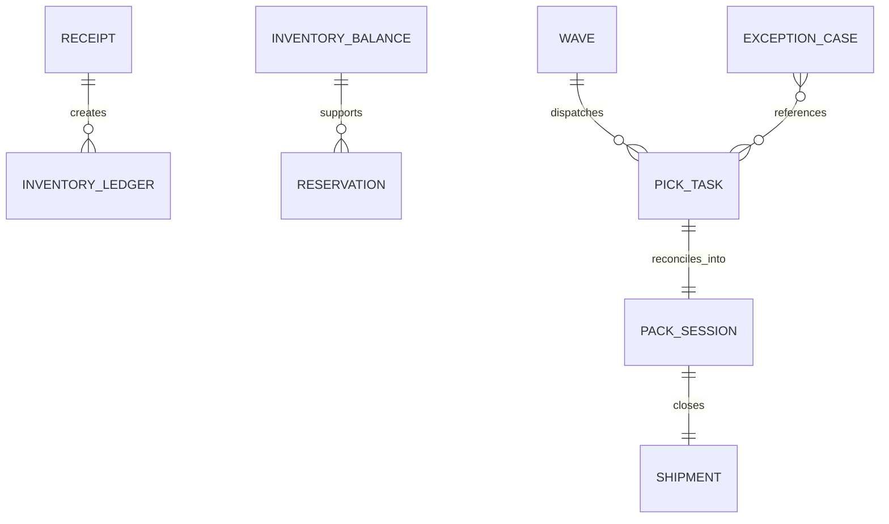

# Domain Model

## Bounded Contexts

| Context | Responsibilities | Aggregates |
|---|---|---|
| Receiving | Validate inbound, create receipts, initiate putaway | `Receipt`, `PutawayBatch` |
| Inventory | Maintain balances/ledger, reservation views | `InventoryBalance`, `InventoryLedger` |
| Allocation | Reserve stock, build waves, reprioritize work | `Reservation`, `Wave` |
| Fulfillment | Execute pick/pack tasks, enforce reconciliation | `PickTask`, `PackSession` |
| Shipping | Confirm handoff, track carrier state | `Shipment` |
| Operations | Manage exceptions/overrides | `ExceptionCase`, `OverrideApproval` |

## Core Domain Relationships

## Aggregate Rules
- `InventoryBalance` enforces `on_hand >= reserved >= 0`.
- `PickTask` transitions governed by state guards only.
- `Shipment` confirmation is terminal except through returns workflow.
