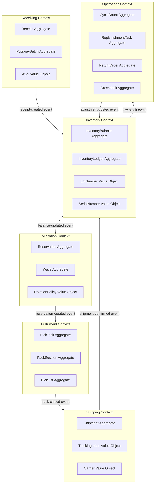

# Domain Model

## Overview

The WMS domain model is structured using Domain-Driven Design (DDD) principles. The domain is decomposed into six Bounded Contexts, each with a clear ubiquitous language, a set of aggregates that enforce invariants, value objects that carry domain meaning without identity, and domain services for cross-aggregate operations.

**Ubiquitous Language Glossary:**
- **Receipt:** A confirmed record of goods received against an ASN or PO line.
- **InventoryBalance:** The real-time count of units on-hand, reserved, and available-to-promise for a SKU+Lot+Bin combination.
- **Reservation:** A soft-hold on inventory units committed to a specific order, preventing double-allocation.
- **Wave:** A planned batch of pick work grouped by zone, shift, or priority tier.
- **PickTask:** A single scanner assignment to pick a specific quantity of a SKU from a bin.
- **PackSession:** A container-level packing reconciliation that validates all pick lines are present before close.
- **Shipment:** The carrier-confirmed dispatch record linking a pack session to a tracking number.
- **CycleCount:** A scheduled or ad-hoc inventory verification scan against a defined bin range.
- **ReplenishmentTask:** An instruction to move stock from bulk storage to a pick face to maintain minimum quantities.

---

## Bounded Contexts Map

---

## Bounded Contexts Table

| Context | Responsibilities | Aggregates | Value Objects | Domain Services | Events Published | Events Consumed |
|---|---|---|---|---|---|---|
| **Receiving** | Validate inbound ASNs, record receipts, manage discrepancies, plan putaway routes | Receipt, PutawayBatch | ASNLine, LicensePlate, BinCode | PutawayRouteService, DiscrepancyService | receipt-created, discrepancy-raised, putaway-assigned | asn-released |
| **Inventory** | Maintain on-hand balances, write ledger entries, serve ATP queries, post adjustments | InventoryBalance, InventoryLedger | LotNumber, SerialNumber, Quantity, Temperature | RotationPolicyService, ATPCalculationService | balance-updated, adjustment-posted, lot-expired | receipt-created, pick-confirmed, shipment-confirmed, cycle-count-adjusted |
| **Allocation** | Reserve stock against orders, apply rotation policies, resolve conflicts, build wave candidates | Reservation, Wave | SkuCode, ReservationKey, RotationPolicy | AllocationService, WavePlanningService | reservation-created, reservation-released, wave-planned | order-released, balance-updated |
| **Fulfillment** | Assign pick tasks, execute scans, handle short picks, reconcile packs | PickTask, PackSession, PickList | PickLine, ScanConfirmation, ContainerBarcode | TaskDispatchService, ReconciliationService | pick-confirmed, short-pick-raised, pack-closed | wave-planned, pick-list-generated |
| **Shipping** | Generate carrier labels, build manifests, confirm shipments, handle carrier failures | Shipment | TrackingNumber, CarrierCode, ManifestId | CarrierRatingService, LabelGenerationService | shipment-confirmed, carrier-failure-raised | pack-closed |
| **Operations** | Schedule and execute cycle counts, manage replenishment, process returns, handle crossdocking | CycleCount, ReplenishmentTask, ReturnOrder, Crossdock | CountVariance, ReplenTrigger, ReturnReason | CycleCountService, ReplenishmentService, ReturnProcessingService | cycle-count-adjusted, replenishment-triggered, return-processed | balance-updated, pick-confirmed, shipment-confirmed |

---

## Aggregate Definitions

### Receipt (Receiving Context)
- **Root Entity:** Receipt
- **Invariants:**
  1. A Receipt cannot be closed if any ReceiptLine has `status = DISCREPANCY` without a supervisory override.
  2. Total received quantity across all lines must not exceed ASN quantity by more than the configured tolerance percentage.
  3. Receipt must reference a valid, open ASN line; receipts against closed or cancelled ASNs are rejected.
- **Commands Handled:** CreateReceipt, ConfirmReceiptLine, RaiseDiscrepancy, CloseReceipt
- **Events Emitted:** ReceiptCreated, ReceiptLineConfirmed, DiscrepancyRaised, ReceiptClosed

### InventoryBalance (Inventory Context)
- **Root Entity:** InventoryBalance (keyed by warehouse_id + sku_code + lot_number + bin_code)
- **Invariants:**
  1. `on_hand >= 0` at all times; write-ahead validation before any deduction.
  2. `reserved <= on_hand`; reservation engine must check available = on_hand − reserved before committing.
  3. Balance mutations are serialised via optimistic locking (version column); concurrent conflicts trigger retry.
- **Commands Handled:** AddStock, DeductStock, ReserveStock, ReleaseReservation, PostAdjustment
- **Events Emitted:** StockAdded, StockDeducted, ReservationPosted, ReservationReleased, AdjustmentPosted

### Reservation (Allocation Context)
- **Root Entity:** Reservation
- **Invariants:**
  1. A Reservation must reference an active, unreleased order line; no orphan reservations.
  2. Quantity reserved cannot exceed the available quantity returned by InventoryBalance at time of reservation.
  3. A Reservation cannot be modified after its associated PickTask is confirmed; only release is permitted.
- **Commands Handled:** CreateReservation, ExtendReservation, ReleaseReservation, ForceRelease
- **Events Emitted:** ReservationCreated, ReservationExtended, ReservationReleased

### Wave (Allocation Context)
- **Root Entity:** Wave
- **Invariants:**
  1. A Wave may only be released if all WaveLines have valid PickList assignments.
  2. Total wave capacity must not exceed configured max lines per zone per wave.
  3. Wave cannot be re-opened after status transitions to RELEASED.
- **Commands Handled:** PlanWave, AddWaveLine, AssignZone, ReleaseWave, CancelWave
- **Events Emitted:** WavePlanned, WaveLineAdded, WaveReleased, WaveCancelled

### PickTask (Fulfillment Context)
- **Root Entity:** PickTask
- **Invariants:**
  1. PickTask can only be assigned to one Scanner/Employee at a time; concurrent assignment is rejected.
  2. PickTask confirmation requires a barcode scan matching the expected SKU + Lot + Bin combination.
  3. Partial quantity confirmation creates a ShortPick record and triggers a reallocation event.
- **Commands Handled:** AssignTask, ConfirmPick, ReportShortPick, SkipTask, CancelTask
- **Events Emitted:** TaskAssigned, PickConfirmed, ShortPickRaised, TaskCancelled

### PackSession (Fulfillment Context)
- **Root Entity:** PackSession
- **Invariants:**
  1. PackSession cannot be closed until all associated PickTasks are in `CONFIRMED` or `SHORT_PICKED` state.
  2. Each ContainerBarcode in the session must be unique and validated against a pre-printed label.
  3. Weight of packed container must be within ±5% of the system-calculated weight; discrepancy triggers manual review.
- **Commands Handled:** OpenPackSession, AddPickToSession, CloseSession, RejectSession
- **Events Emitted:** PackSessionOpened, PickAddedToSession, PackSessionClosed, PackSessionRejected

### Shipment (Shipping Context)
- **Root Entity:** Shipment
- **Invariants:**
  1. Shipment confirmation requires a valid carrier TrackingNumber; unconfirmed shipments cannot be marked as shipped.
  2. A confirmed Shipment is terminal; modifications require a ReturnOrder through the Operations context.
  3. All containers in the Shipment must have a carrier label stored in S3 before confirmation.
- **Commands Handled:** CreateShipment, AssignCarrier, ConfirmShipment, VoidShipment
- **Events Emitted:** ShipmentCreated, CarrierAssigned, ShipmentConfirmed, ShipmentVoided

### CycleCount (Operations Context)
- **Root Entity:** CycleCount
- **Invariants:**
  1. CycleCount must cover all bins in the scheduled zone; partial counts require supervisor approval to proceed.
  2. Variance exceeding the configured threshold (e.g., >$500 or >10 units) requires supervisor sign-off before adjustment is posted.
  3. A bin cannot have two concurrent open CycleCounts.
- **Commands Handled:** ScheduleCycleCount, RecordCount, SubmitVariance, ApproveCycleCount, RejectCycleCount
- **Events Emitted:** CycleCountScheduled, CountRecorded, VarianceSubmitted, CycleCountApproved, AdjustmentPosted

### ReplenishmentTask (Operations Context)
- **Root Entity:** ReplenishmentTask
- **Invariants:**
  1. A ReplenishmentTask is only created if the pick face balance drops below the configured minimum quantity for that SKU+Bin.
  2. ReplenishmentTask quantity must not exceed the physical capacity of the destination pick face bin.
  3. Duplicate replenishment tasks for the same SKU+Bin are deduplicated; only one open task per bin is allowed.
- **Commands Handled:** CreateReplenTask, AssignReplenTask, ConfirmReplenishment, CancelReplenTask
- **Events Emitted:** ReplenTaskCreated, ReplenTaskAssigned, ReplenishmentCompleted

### ReturnOrder (Operations Context)
- **Root Entity:** ReturnOrder
- **Invariants:**
  1. A ReturnOrder must reference a previously confirmed Shipment; returns without a shipment reference are rejected.
  2. Return quantity per line cannot exceed original shipped quantity.
  3. Returned items must be assigned a disposition (RESTOCK, QUARANTINE, DESTROY) before the return is closed.
- **Commands Handled:** CreateReturnOrder, ReceiveReturnLine, SetDisposition, CloseReturn
- **Events Emitted:** ReturnOrderCreated, ReturnLineReceived, DispositionSet, ReturnOrderClosed

---

## Value Objects

| Value Object | Fields | Invariants |
|---|---|---|
| **BinCode** | warehouse_id, zone_code, aisle, bay, level, position | Format: `{zone}-{aisle}{bay}-{level}{position}`, unique per warehouse |
| **SkuCode** | sku_id, sku_class, variant_code | Immutable once assigned; references ProductMaster |
| **LotNumber** | lot_id, manufacture_date, expiry_date, supplier_id | Expiry date must be ≥ manufacture_date |
| **TrackingNumber** | carrier_code, raw_tracking, barcode_format | Format validated against carrier barcode spec |
| **Quantity** | value, unit_of_measure | value ≥ 0; UOM must be in approved enum |
| **Weight** | value, unit (kg/lb) | value > 0; unit validated against carrier requirements |
| **Volume** | length, width, height, unit (cm/in) | All dimensions > 0 |
| **Temperature** | min_celsius, max_celsius | min < max; used for cold chain validation |
| **Address** | street, city, state, postal_code, country_code | Country code must be ISO-3166 alpha-2 |

---

## Domain Services

| Service | Context | Responsibility |
|---|---|---|
| **AllocationService** | Allocation | Orchestrates reservation across multiple bins; selects bins by rotation policy; handles conflict retry |
| **WavePlanningService** | Allocation | Groups reservations into wave candidates; applies zone balancing, batch size limits, and priority tiers |
| **RotationPolicyService** | Inventory / Allocation | Evaluates FIFO (by receipt date), FEFO (by expiry date), LIFO, and custom scoring; returns ordered bin candidates |
| **CarrierRatingService** | Shipping | Queries carrier rate APIs; applies business rules for carrier selection; returns ranked carrier options |

---

## Domain Events

| Event | Context | Trigger | Key Payload Fields |
|---|---|---|---|
| ReceiptCreated | Receiving | ASN line confirmed received | receipt_id, sku_code, lot_number, qty, bin_code |
| DiscrepancyRaised | Receiving | Quantity or condition mismatch | receipt_id, expected_qty, actual_qty, reason |
| PutawayAssigned | Receiving | Putaway route generated | putaway_task_id, bin_code, employee_id |
| BalanceUpdated | Inventory | Any stock mutation | sku_code, bin_code, on_hand_delta, new_on_hand |
| AdjustmentPosted | Inventory | Cycle count or manual override | adjustment_id, variance_qty, approver_id |
| ReservationCreated | Allocation | Stock reserved for order | reservation_id, order_id, sku_code, qty |
| ReservationReleased | Allocation | Order cancelled or pick confirmed | reservation_id, reason |
| WavePlanned | Allocation | Wave candidate finalised | wave_id, zone_ids, line_count |
| WaveReleased | Allocation | Wave approved and dispatched | wave_id, pick_list_ids |
| PickConfirmed | Fulfillment | Scanner confirmed pick | pick_task_id, actual_qty, scan_timestamp |
| ShortPickRaised | Fulfillment | Insufficient stock at bin | pick_task_id, expected_qty, actual_qty |
| PackSessionClosed | Fulfillment | Pack reconciliation passed | pack_session_id, container_barcodes, total_weight |
| ShipmentConfirmed | Shipping | Carrier tracking number received | shipment_id, tracking_number, carrier_code |
| CycleCountAdjusted | Operations | Supervisor approved variance | cycle_count_id, adjustments[] |
| ReplenishmentTriggered | Operations | Pick face below minimum | replen_task_id, sku_code, bin_code, required_qty |
| ReturnOrderClosed | Operations | All lines dispositioned | return_order_id, restocked_qty, quarantine_qty |

---

## Context Map

| Relationship | Upstream | Downstream | Pattern |
|---|---|---|---|
| Receiving → Inventory | Receiving | Inventory | Published Language (domain events via Kafka) |
| Inventory → Allocation | Inventory | Allocation | Published Language (balance-updated events) |
| Allocation → Fulfillment | Allocation | Fulfillment | Published Language (wave-planned events) |
| Fulfillment → Shipping | Fulfillment | Shipping | Published Language (pack-closed events) |
| Shipping → Inventory | Shipping | Inventory | Published Language (shipment-confirmed events) |
| Operations → Inventory | Operations | Inventory | Published Language (adjustment-posted events) |
| OMS → Allocation | OMS (external) | Allocation | Anti-Corruption Layer (OMS order translated to WMS reservation request) |
| ERP → Receiving | ERP (external) | Receiving | Anti-Corruption Layer (ERP PO/ASN translated to WMS ASN model) |
| Inventory ↔ Allocation | Shared Kernel | Shared Kernel | Shared Kernel: SkuCode, LotNumber, BinCode value objects shared |
