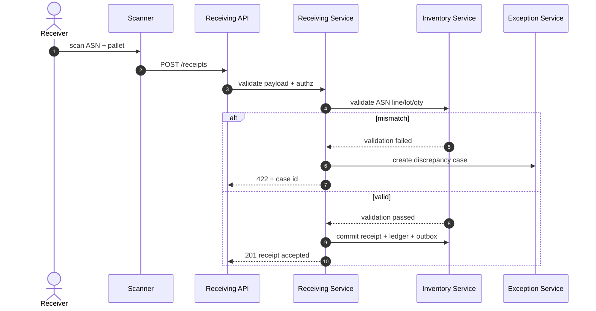
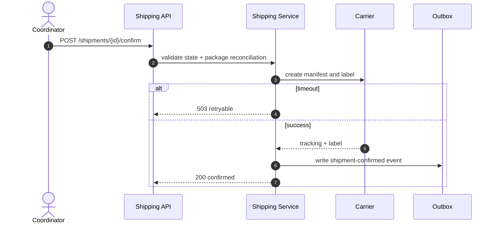

# System Sequence Diagrams

## Sequence: Receive Pallet with Validation

```mermaid
sequenceDiagram
    autonumber
    actor Receiver
    participant Scanner
    participant API as Receiving API
    participant REC as Receiving Service
    participant INV as Inventory Service
    participant EX as Exception Service

    Receiver->>Scanner: scan ASN + pallet
    Scanner->>API: POST /receipts
    API->>REC: validate payload + authz
    REC->>INV: validate ASN line/lot/qty
    alt mismatch
      INV-->>REC: validation failed
      REC->>EX: create discrepancy case
      REC-->>API: 422 + case id
    else valid
      INV-->>REC: validation passed
      REC->>INV: commit receipt + ledger + outbox
      REC-->>API: 201 receipt accepted
    end
```

## Sequence: Confirm Shipment

```mermaid
sequenceDiagram
    autonumber
    actor Coordinator
    participant API as Shipping API
    participant SH as Shipping Service
    participant Carrier
    participant Outbox

    Coordinator->>API: POST /shipments/{id}/confirm
    API->>SH: validate state + package reconciliation
    SH->>Carrier: create manifest and label
    alt timeout
      SH-->>API: 503 retryable
    else success
      Carrier-->>SH: tracking + label
      SH->>Outbox: write shipment-confirmed event
      SH-->>API: 200 confirmed
    end
```
