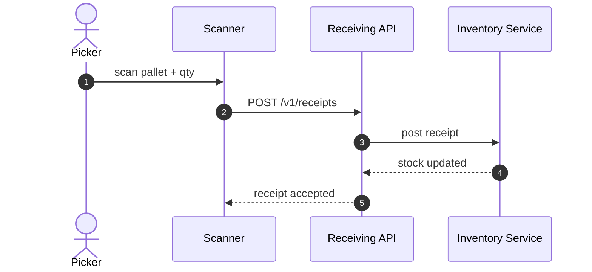
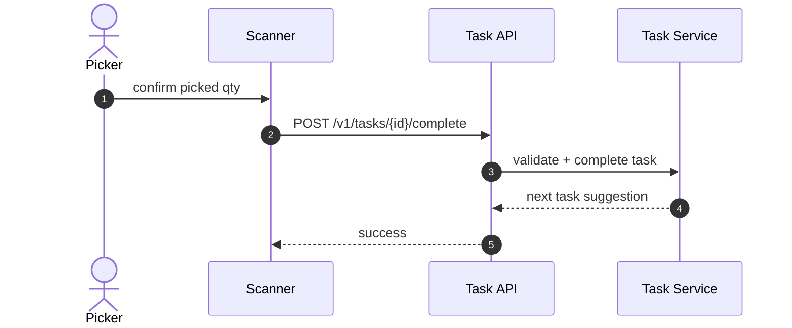

# System Sequence Diagrams

## System Sequence: Receive Pallet

```mermaid
sequenceDiagram
    autonumber
    actor Picker
    participant Scanner
    participant API as Receiving API
    participant INV as Inventory Service

    Picker->>Scanner: scan pallet + qty
    Scanner->>API: POST /v1/receipts
    API->>INV: post receipt
    INV-->>API: stock updated
    API-->>Scanner: receipt accepted
```

## System Sequence: Complete Pick Task

```mermaid
sequenceDiagram
    autonumber
    actor Picker
    participant Scanner
    participant API as Task API
    participant Task as Task Service

    Picker->>Scanner: confirm picked qty
    Scanner->>API: POST /v1/tasks/{id}/complete
    API->>Task: validate + complete task
    Task-->>API: next task suggestion
    API-->>Scanner: success
```
