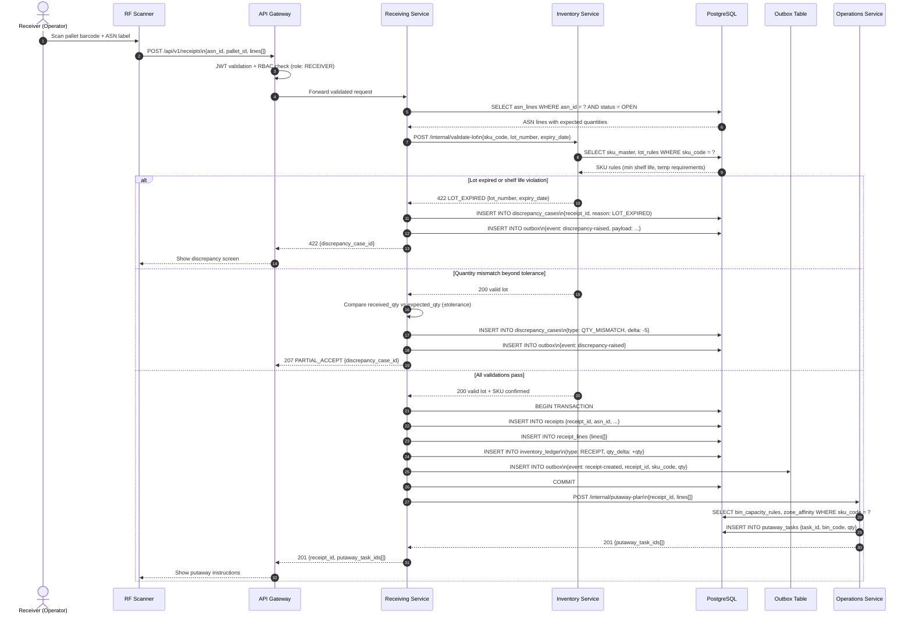
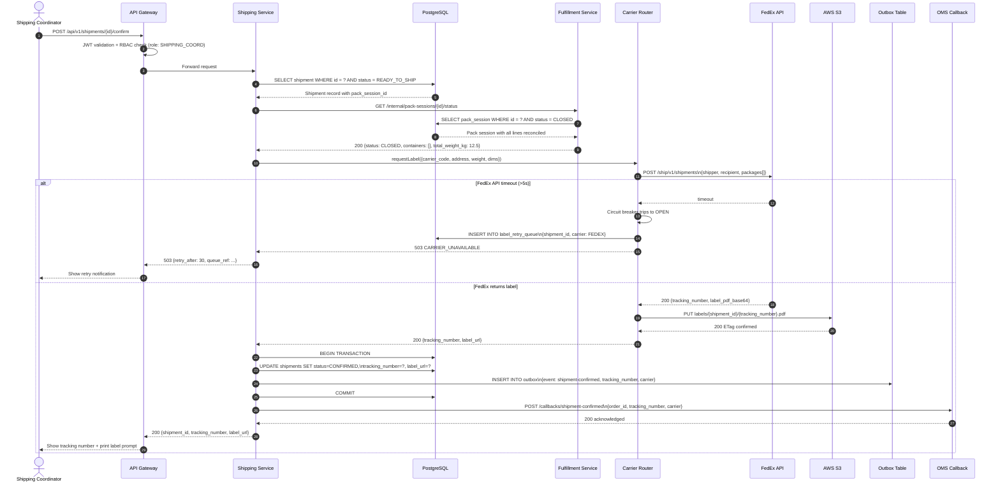
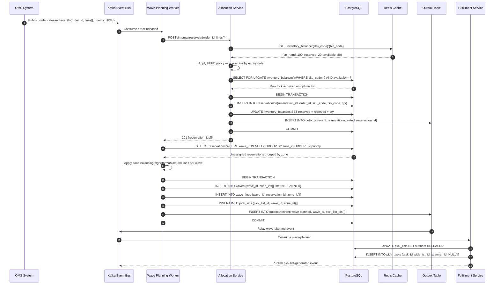
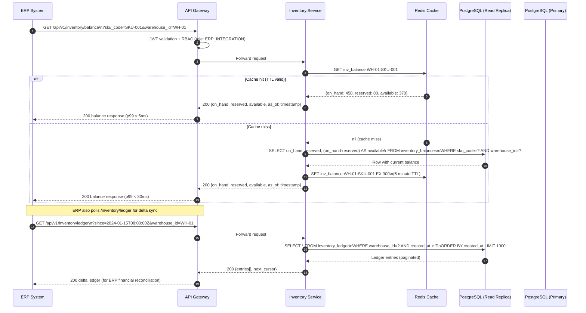
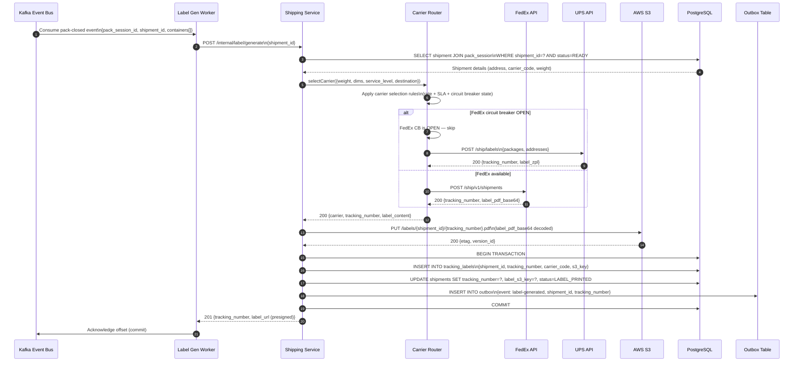

# System Sequence Diagrams

## Overview

This document presents system-level sequence diagrams for the six most critical interactions in the WMS. Each diagram shows the full end-to-end flow including database writes, outbox event publications, and external system callbacks. All sequences use `autonumber` for step traceability and include both happy-path and failure branches.

---

## Sequence 1: Receive Pallet with ASN Validation



---

## Sequence 2: Confirm Shipment with Carrier Integration



---

## Sequence 3: Wave Planning with OMS Integration



---

## Sequence 4: Real-Time Inventory Query from ERP



---

## Sequence 5: Carrier Label Generation Flow



---

## Sequence 6: Cycle Count Approval and Adjustment

```mermaid
sequenceDiagram
    autonumber
    actor Operator as Warehouse Operator
    actor Supervisor as Supervisor
    participant Scanner as RF Scanner
    participant APIGW as API Gateway
    participant OpsSvc as Operations Service
    participant InvSvc as Inventory Service
    participant PG as PostgreSQL
    participant Outbox as Outbox Table
    participant Kafka as Kafka Event Bus

    Supervisor->>APIGW: POST /api/v1/cycle-counts\n{zone_id, bin_range: A01-A20, scheduled_for}
    APIGW->>OpsSvc: Create cycle count
    OpsSvc->>PG: INSERT INTO cycle_counts\n{count_id, zone_id, bin_range, status: SCHEDULED}
    OpsSvc->>PG: INSERT INTO cycle_count_lines {count_id, bin_code, sku_code, system_qty}[]
    OpsSvc-->>APIGW: 201 {count_id, line_count: 20}
    APIGW-->>Supervisor: Cycle count created

    Operator->>Scanner: Start cycle count scan
    Scanner->>APIGW: POST /api/v1/cycle-counts/{id}/lines/{bin}/record\n{counted_qty, scan_timestamp}
    APIGW->>OpsSvc: Record count for bin
    OpsSvc->>PG: UPDATE cycle_count_lines\nSET counted_qty=?, status=COUNTED WHERE bin_code=?
    OpsSvc->>OpsSvc: Calculate variance = counted_qty - system_qty
    OpsSvc-->>APIGW: 200 {variance: -3, threshold_exceeded: true}
    APIGW-->>Scanner: Show variance flag (supervisor approval required)

    Operator->>APIGW: POST /api/v1/cycle-counts/{id}/submit
    APIGW->>OpsSvc: Submit count for review
    OpsSvc->>PG: UPDATE cycle_counts SET status=PENDING_APPROVAL
    OpsSvc-->>APIGW: 200 submitted

    Supervisor->>APIGW: GET /api/v1/cycle-counts/{id}/variance-report
    APIGW->>OpsSvc: Get variance summary
    OpsSvc->>PG: SELECT SUM(ABS(variance)) as total_variance,\nCOUNT(*) FILTER (WHERE ABS(variance)>0) as lines_with_variance
    PG-->>OpsSvc: {total_variance: 7, lines_with_variance: 2, total_value: $340}
    OpsSvc-->>APIGW: 200 variance report
    APIGW-->>Supervisor: Show variance report

    Supervisor->>APIGW: POST /api/v1/cycle-counts/{id}/approve\n{approval_note: "Recount confirmed, adjust"}
    APIGW->>OpsSvc: Approve and post adjustment

    OpsSvc->>PG: BEGIN TRANSACTION
    OpsSvc->>PG: UPDATE cycle_counts SET status=APPROVED, approved_by=?, approved_at=NOW()
    OpsSvc->>InvSvc: POST /internal/adjustments\n{lines: [{sku_code, bin_code, delta_qty, reason: CYCLE_COUNT}]}
    InvSvc->>PG: INSERT INTO inventory_ledger\n{type: CYCLE_COUNT_ADJ, qty_delta: -3}
    InvSvc->>PG: UPDATE inventory_balances SET on_hand = on_hand + delta_qty
    InvSvc->>Outbox: INSERT INTO outbox\n{event: adjustment-posted, count_id, adjustments[]}
    InvSvc->>PG: COMMIT
    InvSvc-->>OpsSvc: 200 adjustments posted
    OpsSvc->>Outbox: INSERT INTO outbox\n{event: cycle-count-adjusted, count_id}
    OpsSvc->>PG: COMMIT outer transaction
    OpsSvc-->>APIGW: 200 {count_id, adjusted_lines: 2, total_delta: -3}
    APIGW-->>Supervisor: Adjustment confirmed

    Outbox->>Kafka: Relay cycle-count-adjusted + adjustment-posted events
    note over Kafka: Reporting service consumes for KPI updates\nInventory cache invalidated by adjustment-posted event
