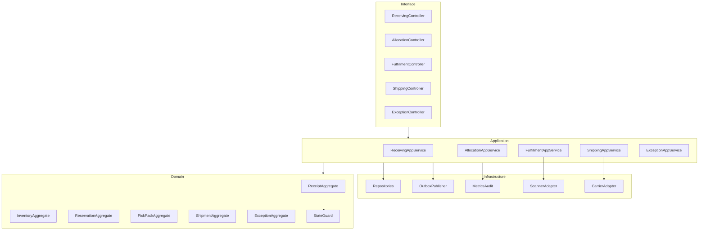

# C4 Code Diagram

## Code-Level Notes
- Aggregates own invariants; services orchestrate transactions.
- StateGuard library is reused by API and worker handlers.
- OutboxPublisher is invoked only after commit.
