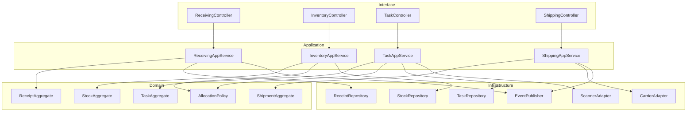

# C4 Code Diagram

```mermaid
flowchart TB
    subgraph Interface
      ReceivingController
      InventoryController
      TaskController
      ShippingController
    end

    subgraph Application
      ReceivingAppService
      InventoryAppService
      TaskAppService
      ShippingAppService
    end

    subgraph Domain
      ReceiptAggregate
      StockAggregate
      TaskAggregate
      ShipmentAggregate
      AllocationPolicy
    end

    subgraph Infrastructure
      ReceiptRepository
      StockRepository
      TaskRepository
      CarrierAdapter
      ScannerAdapter
      EventPublisher
    end

    ReceivingController --> ReceivingAppService --> ReceiptAggregate
    InventoryController --> InventoryAppService --> StockAggregate
    TaskController --> TaskAppService --> TaskAggregate
    ShippingController --> ShippingAppService --> ShipmentAggregate

    InventoryAppService --> AllocationPolicy
    TaskAppService --> AllocationPolicy

    ReceivingAppService --> ReceiptRepository
    InventoryAppService --> StockRepository
    TaskAppService --> TaskRepository
    ShippingAppService --> CarrierAdapter
    TaskAppService --> ScannerAdapter

    ReceivingAppService --> EventPublisher
    ShippingAppService --> EventPublisher
```
