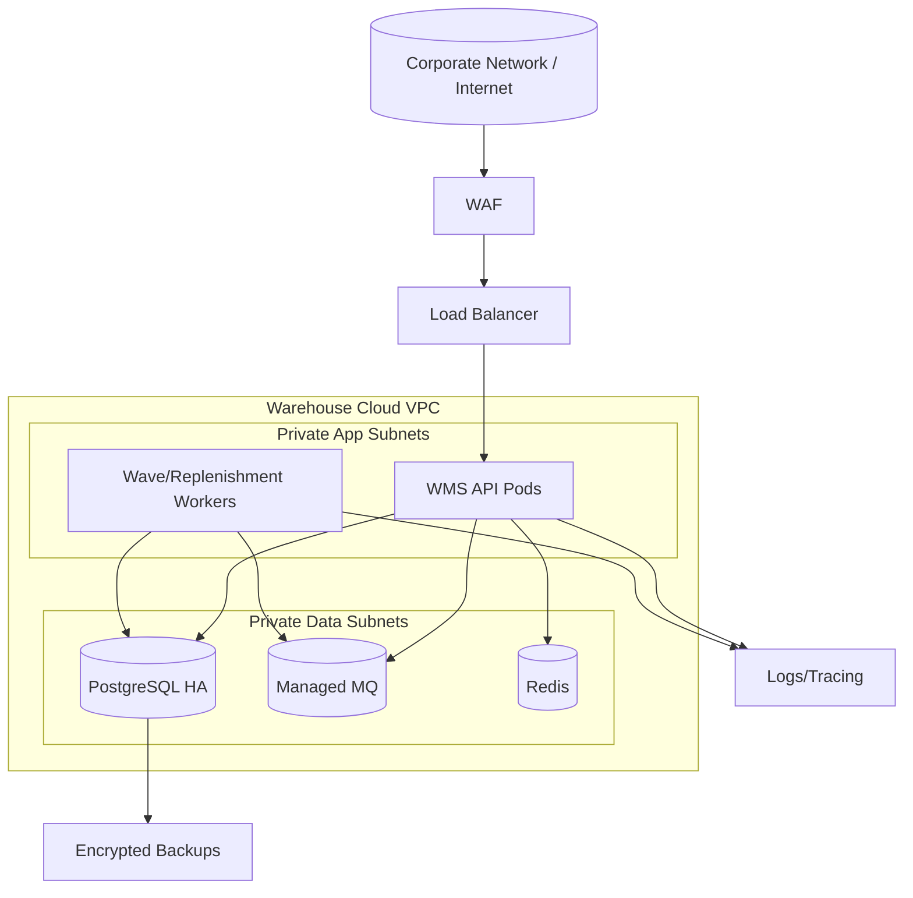
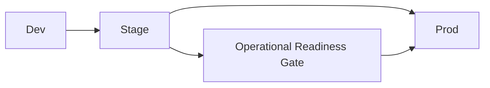

# Deployment Diagram

## Production Deployment

```mermaid
flowchart TB
    Edge[(Corporate Network / Internet)] --> WAF[WAF]
    WAF --> LB[Load Balancer]

    subgraph VPC[Warehouse Cloud VPC]
      subgraph App[Private App Subnets]
        API[WMS API Pods]
        Worker[Wave/Replenishment Workers]
      end

      subgraph Data[Private Data Subnets]
        DB[(PostgreSQL HA)]
        MQ[(Managed MQ)]
        Redis[(Redis)]
      end
    end

    LB --> API
    API --> DB
    API --> MQ
    API --> Redis
    Worker --> DB
    Worker --> MQ

    API --> Obs[Logs/Tracing]
    Worker --> Obs
    DB --> Backup[Encrypted Backups]
```

## Environment Promotion

```mermaid
flowchart LR
    Dev --> Stage --> Prod
    Stage --> Gate[Operational Readiness Gate]
    Gate --> Prod
```
