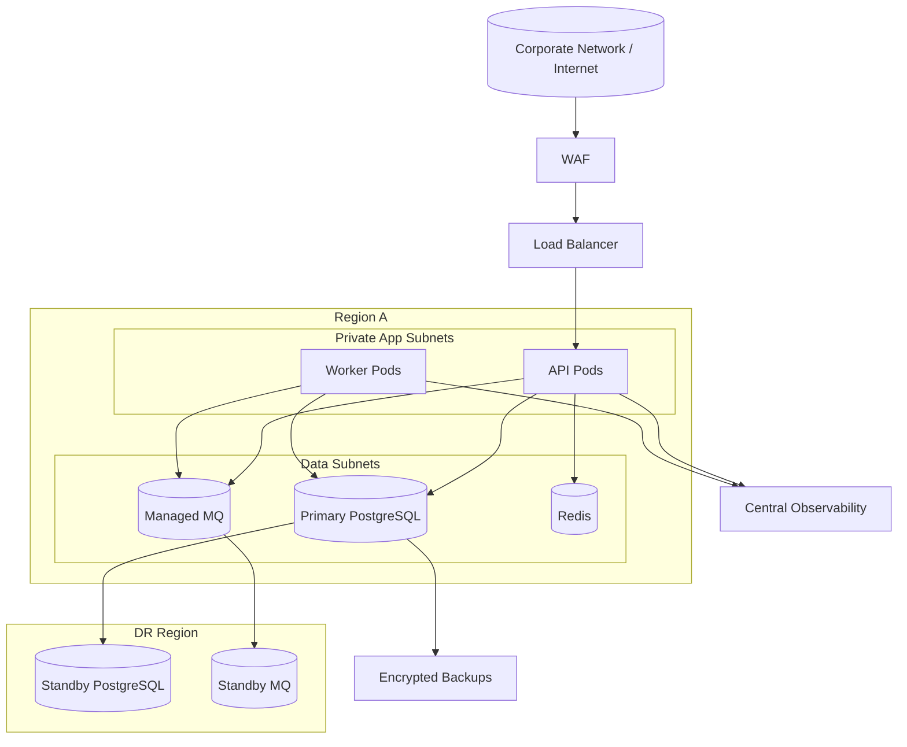

# Deployment Diagram

## Production Deployment

## Deployment Controls
- Blue/green deploy for API tier.
- Canary worker rollout for allocation/shipping queues.
- Automated rollback when SLO burn exceeds threshold.
