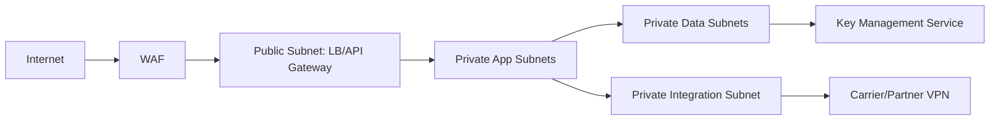

# Network Infrastructure

## Network Segmentation Model

## Security Controls
- Ingress restricted to WAF/API gateway; no direct DB exposure.
- East-west traffic via mTLS + service identities.
- Egress allow-list for OMS/ERP/carrier endpoints.
- Network policies isolate high-risk worker pools.

## Reliability Controls
- Multi-AZ subnets for API and data nodes.
- Dedicated queue-processing subnets to avoid API starvation.
- QoS/traffic shaping for scanner bursts during shift changes.

## Operational Guidance
- Flow logs retained for incident forensics.
- Synthetic probes validate partner connectivity every 60s.
- Security group changes require change-ticket and approval evidence.
