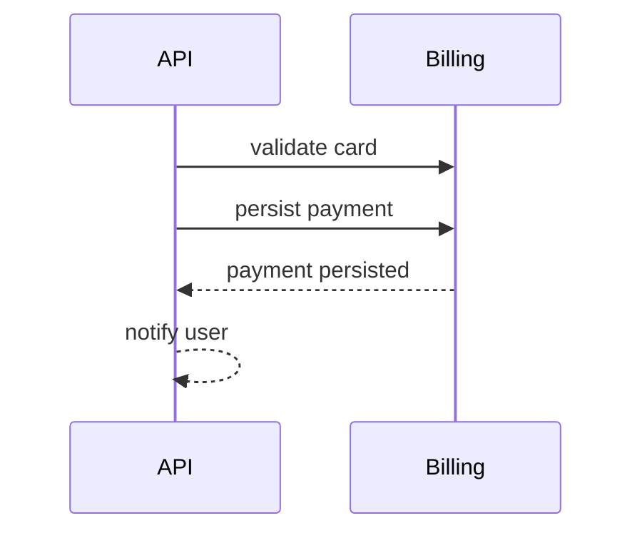

# Mermaid Authoring Rules

Use this guide when adding or editing Mermaid diagrams in this repository.

## Do

- Keep diagrams small and focused; split large flows into multiple diagrams.
- Start each Mermaid fence with an explicit diagram declaration (for example `flowchart TD`, `sequenceDiagram`, `erDiagram`).
- In `sequenceDiagram`, keep participant IDs simple: letters, numbers, and underscores only.
- In `sequenceDiagram`, keep one action per message line.
- Use comments (`%% ...`) for author notes instead of overloading message text.

## Don't

- Do **not** use `;` in `sequenceDiagram` message text.
- Do **not** combine multiple actions in one message line (for example “validate and persist then notify”).
- Do **not** use special characters or spaces in participant IDs (for example `participant billing-service` or `participant Billing Service`).
- Do **not** leave Mermaid fences unterminated.
- Do **not** rely on implicit diagram types.

## Before/After examples

### Avoid semicolons and multi-action lines

Bad:

```text
sequenceDiagram
    participant API
    participant Billing
    API->>Billing: validate card; persist payment and notify user
```

Good:



## How to validate before commit

Run validation against all Markdown files:

```bash
python3 scripts/validate-mermaid.py
```

Run validation only for specific files:

```bash
python3 scripts/validate-mermaid.py README.md docs/mermaid-authoring-rules.md
```

Tip for staged Markdown changes:

```bash
python3 scripts/validate-mermaid.py $(git diff --name-only --cached -- '*.md')
```
